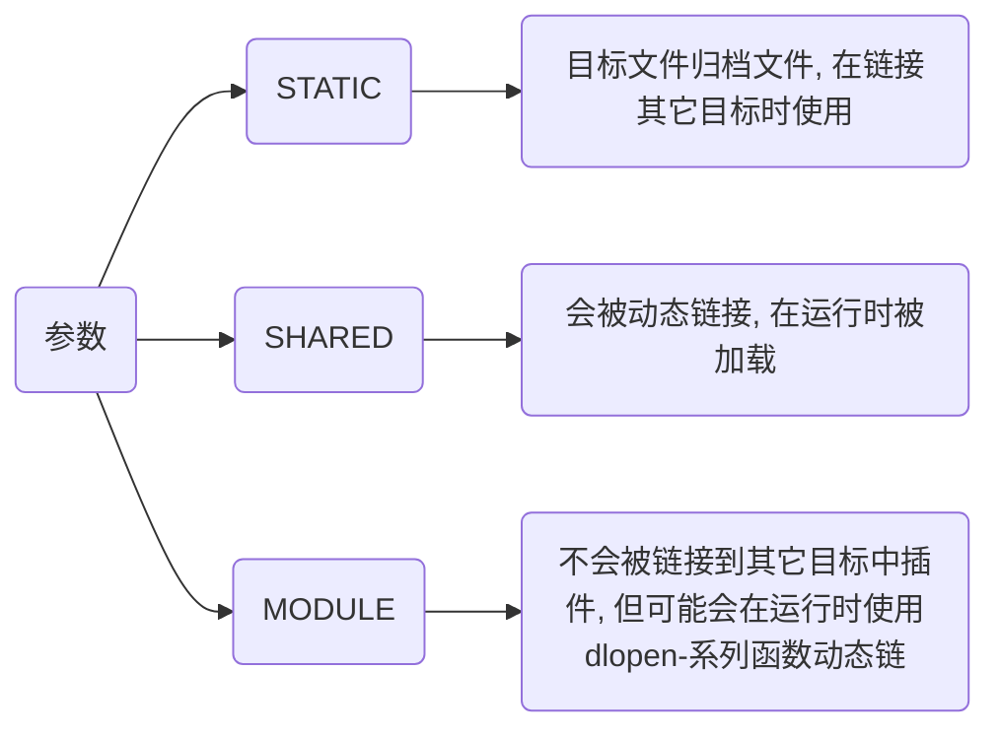

# CMake语法

## 设置

### cmake_minimum_required

设置一个工程所需最低CMake版本

```cmake
cmake_minimum_required(VERSION major[.minor[.patch[.tweak]]] [FATAL_ERROR])
```

- 设置该工程最低CMake版本为3.10

```cmake
cmake_minimum_required(VERSION 3.10)
```

### project

设置项目名与版本

```cmake
project(Test VERSION 1.0)
```

### set

将一个CMAKE变量设置为给定值

```cmake
set(<variable> <value> [[CACHE <type> <docstring> [FORCE]] | PARENT_SCOPE])
```

- 设置为C++版本为C++11

```cmake
set(CMAKE_CXX_STANDARD 11)
```

- 设置Main.cpp、Test.cpp名称为SRC_LIST

```cmake
set(SRC_LIST Main.cpp Test.cpp)
```

## 添加

### include_directories

为构建树添加包含路径, 作用域为全局

```cmake
include_directories([AFTER|BEFORE] [SYSTEM] dir1 dir2 ...)
```

### target_link_libraries

将库链接到可执行文件

```cmake
target_link_libraries(MyExecutable PRIVATE MyLibrary)
```

### add_subdirectory

为构建添加一个子路径

```cmake
add_subdirectory([source_dir] [binary_dir] [EXCLUDE_FROM_ALL])
```

source_dir选项指定CMakeLists.txt源文件和代码文件位置, 若是相对路径会被解释为相对于当前目录, 也可以是绝对路径

binary_dir选项指定了输出文件路径, 若是相对路径会被解释为相对于当前输出路径, 也可以是绝对路径

若没有指定binary_dir, 其值将会是没有做任何相对路径展开source_dir值

## 生成

### add_library

根据调用命令里源文件来创建库文件

```cmake
add_library(<name> [STATIC | SHARED | MODULE] [EXCLUDE_FROM_ALL] source1 source2 ... sourceN)
```

name 对应于逻辑目标名称, 在工程全局域内必须唯一

待构建库文件实际文件名根据对应平台命名约定来构造(比如lib<name>.a或者<name>.lib)



### add_executable

生成可执行文件

```cmake
add_executable([可执行文件名] [源文件])
```

## 安装

### 可执行文件

```sh
install(TARGETS <可执行文件名> RUNTIME DESTINATION <安装路径>)
```

- 安装可执行文件到bin目录

```cmake
install(TARGETS MyExecutable RUNTIME DESTINATION bin) 
```

### 库文件

- 动态库

```cmake
install(TARGETS <库名> LIBRARY DESTINATION <安装路径>)
```

- 静态库

```cmake
install(TARGETS <库名> ARCHIVE DESTINATION <安装路径>)
```

### 目录

```cmake
install(DIRECTORY <源路径> DESTINATION <目标路径>)
```

#### 文件匹配过滤

```cmake
install(DIRECTORY <源路径> DESTINATION <目标路径> FILES_MATCHING PATTERN <匹配规则>)
```

- 仅安装 .h 和 .hpp 文件

```cmake
install(DIRECTORY ${CMAKE_SOURCE_DIR}/Src DESTINATION Shared FILES_MATCHING PATTERN "*.h" PATTERN "*.hpp")
```

## 常量

TODO

