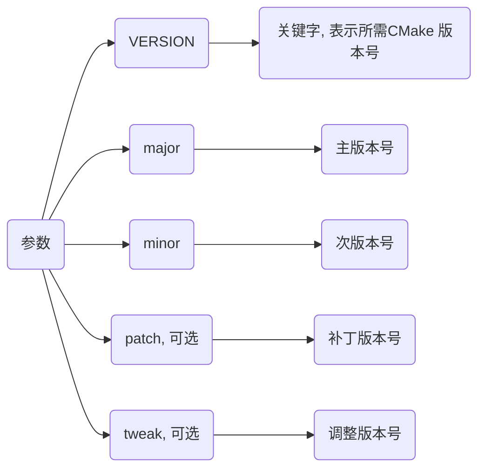
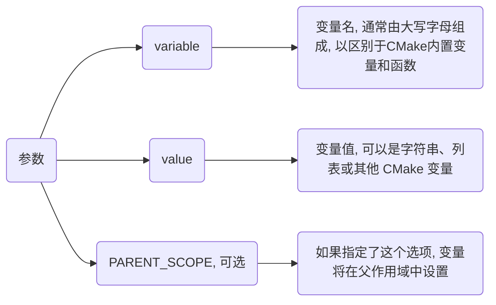
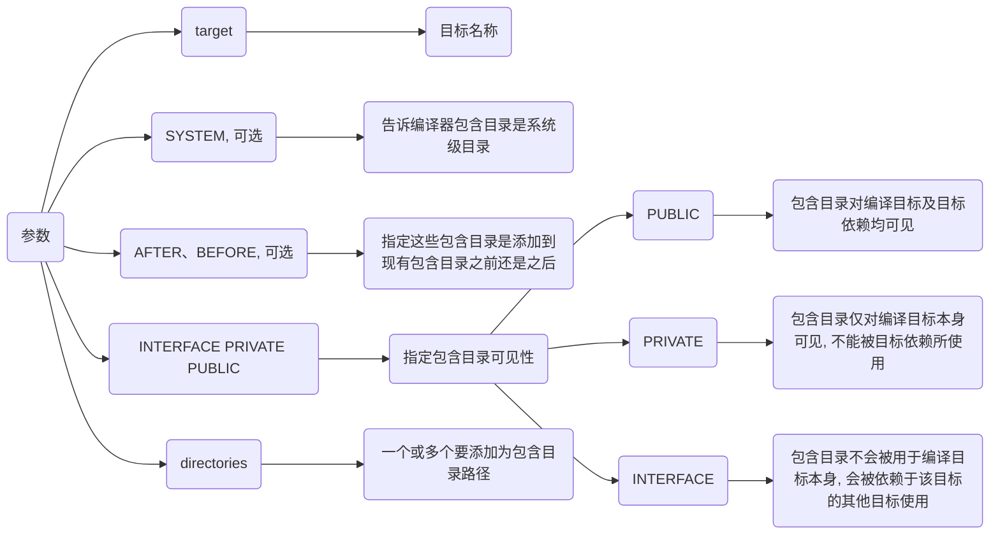
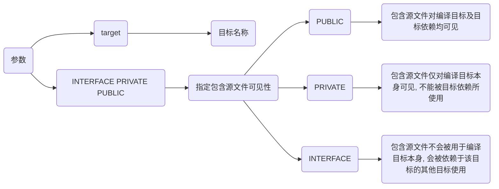
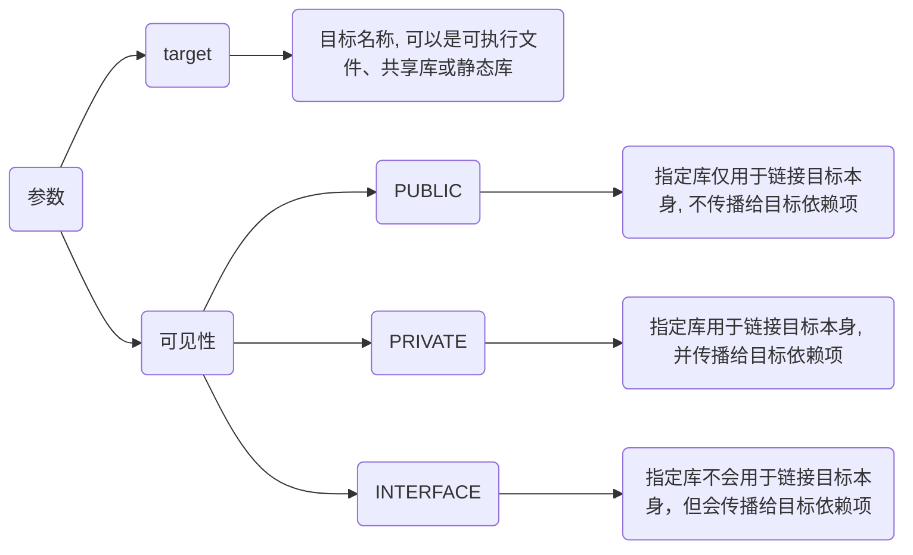
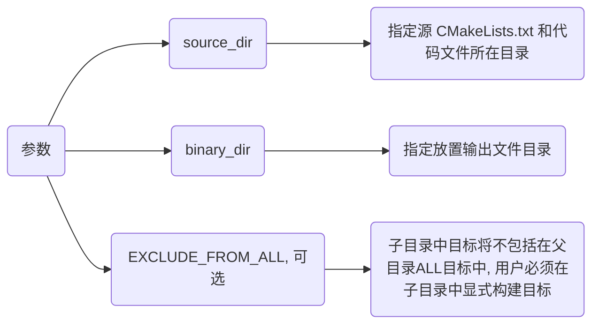
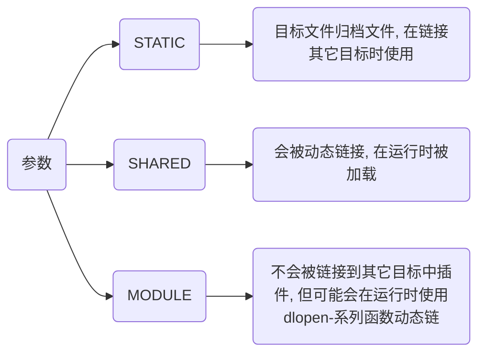

# 语法

## 设置

### cmake_minimum_required

设置一个工程所需最低CMake版本

```cmake
cmake_minimum_required(VERSION .[.[.]])
```



- 设置该工程最低CMake版本为3.10

```cmake
cmake_minimum_required(VERSION 3.10)
...
```

### project

设置项目名与版本

```cmake
project(项目名 VERSION 版本信息)
```

### set

设置CMAKE变量值

```cmake
set( [PARENT_SCOPE])
```



#### 简单变量

```cmake
set(MY_VAR "Hello, World!")
```

#### 列表变量

```cmake
set(MY_LIST "item1" "item2" "item3")

set(SRC_LIST Main.cpp Test.cpp)

foreach(item IN LISTS MY_LIST)
    message(STATUS "List item: ${item}")
endforeach()
```

#### 使用变量作为值

```cmake
set(ANOTHER_VAR "Another Value")

set(MY_VAR2 ${ANOTHER_VAR})
```

#### 在父作用域中设置变量

```cmake
function(my_function)
    set(MY_VAR_INSIDE "Inside Function" PARENT_SCOPE)
endfunction()

my_function()
message(STATUS "The value of MY_VAR_INSIDE after function call is: ${MY_VAR_INSIDE}")
```

my_function 函数内部使用 set 命令并指定 PARENT_SCOPE 选项来在父作用域中设置 MY_VAR_INSIDE 变量

即使在函数调用之后MY_VAR_INSIDE 也可以在外部作用域中访问

## 添加

### target_include_directories

```cmake
target_include_directories( [SYSTEM] [AFTER|BEFORE] ...)
```



```cmake
# 为 mylib 目标添加包含目录
target_include_directories(mylib PUBLIC "${CMAKE_SOURCE_DIR}/include")
```

### target_sources

```cmake
target_sources( [items1...])
```



### target_link_libraries

指定链接给定目标和/或其依赖项

```cmake
target_link_libraries( ...)
```



#### 链接系统库

如果项目需要链接系统库, 可以直接使用库名称(如 pthread、dl、m 等)或系统库变量(如 ${CMAKE_THREAD_LIBS_INIT})

```cmake
target_link_libraries(mytarget pthread)
target_link_libraries(mytarget ${CMAKE_THREAD_LIBS_INIT})
```

#### 链接自定义库

```cmake
target_link_libraries(mytarget PRIVATE mylibrary)
target_link_libraries(mytarget PUBLIC ${CMAKE_SOURCE_DIR}/lib/libexample.a)
target_link_libraries(mytarget INTERFACE ${CMAKE_SOURCE_DIR}/lib/libanother.so)
```

### add_subdirectory

为构建添加一个子路径

```cmake
add_subdirectory([source_dir] [binary_dir] [EXCLUDE_FROM_ALL])
```

source_dir选项指定CMakeLists.txt源文件和代码文件位置, 若是相对路径会被解释为相对于当前目录, 也可以是绝对路径

binary_dir选项指定了输出文件路径, 若是相对路径会被解释为相对于当前输出路径, 也可以是绝对路径

若没有指定binary_dir, 其值将会是没有做任何相对路径展开source_dir值



## 生成

### add_library

根据调用命令里源文件来创建库文件

```cmake
add_library( [STATIC | SHARED | MODULE] [EXCLUDE_FROM_ALL] source1 source2 ...)
```

库名对应于逻辑目标名称, 在工程全局域内必须唯一



### add_executable

生成可执行文件

```cmake
add_executable([可执行文件名] [源文件])
```

## 安装

### 目标文件

#### 可执行文件

```sh
install(TARGETS RUNTIME DESTINATION )
```

- 安装可执行文件MyExecutable到bin目录

```cmake
install(TARGETS MyExecutable RUNTIME DESTINATION bin)
```

#### 动态库

```cmake
install(TARGETS LIBRARY DESTINATION )
```

#### 静态库

```cmake
install(TARGETS ARCHIVE DESTINATION )
```

### 目录

```cmake
install(DIRECTORY DESTINATION )
```

#### 文件匹配过滤

```cmake
install(DIRECTORY DESTINATION FILES_MATCHING PATTERN )
```

- 仅安装 .h 和 .hpp 文件

```cmake
install(DIRECTORY ${CMAKE_SOURCE_DIR}/Src DESTINATION Shared FILES_MATCHING PATTERN "*.h" PATTERN "*.hpp")
```

## 常量

TODO