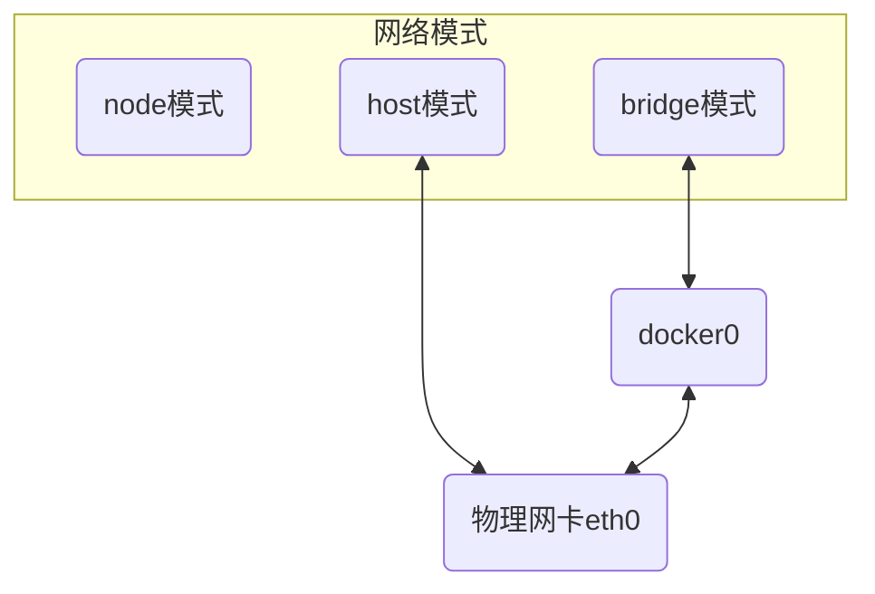

## 概念

docker进程启动时会在主机上创建虚拟网桥`docker0`, 启动容器时若不指定网络模式, 则容器网络默认连接到`docker0`



### 类型

#### bridge 桥接模式

默认网络模式, docker启动时会在主机上创建`docker0`虚拟网桥, 桥接模式下`docker0`会创建一组对等虚拟设备接口`veth`与容器内部虚拟网卡`eth0`

该模式下每个容器会分配独立IP, 容器间网络互相隔离, 可通过网桥通信, 容器可访问外部网络, 可被外部网络访问

#### host 主机模式

该模式下容器直接使用宿主机网络, 容器除网络外其他比如文件系统、进程等依然隔离

#### none 无网络模式

该模式下容器无任何网络接口, 无法与外部或其他容器通信

#### Container 复用模式

该模式下新创建容器会复用另一个已存在容器网络配置

被复用容器与原容器网络完全相同

#### MACVALN模式

该模式下docker会为每个容器分配MAC地址, 使其在网络中表现为物理设备

## 命令

### 查看

```sh
docker network ls
```

- 示例, 查看当前网络


### 创建

#### 默认IP

```sh
docker network create --driver 网络类型 网络名
```

- 示例, 创建默认网络default_bridge

docker会自定义为其分配IP网段和网关


#### 自定义网关网络

```sh
docker network create --driver 网络类型 --subnet 网段 --gateway 网关IP 网络名
```

- 示例, 创建自定义网络self_bridge

网段172.20.0.0/24, 网关172.20.0.1


### 使用

```sh
docker run -itd --net=网络名 (--ip=自定义IP) (--name=容器名) 镜像
```

- 示例, 使用默认与指定IP

创建busybox_1, 使用default_bridge网络与默认IP; 创建busybox_2, 使用self_bridge网络并指定IP


#### 互联

```sh
docker network connect 网络名 容器名
```

- 示例, 容器网络互联

将busybox_2连接到busbox_1网络


### 删除

```sh
docker network rm 网络名
```

- 示例, 删除网络

