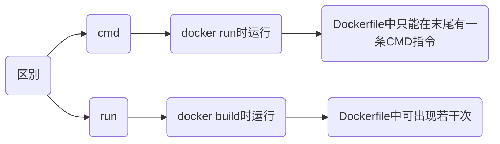

# 使用

## 指令

### from

from 用来指定构建镜像的基础镜像

每个 Dockerfile 都需要以 from 开头来定义要基于哪个镜像创建, 基础镜像可以是官方 Docker 镜像、其他开源镜像

```docker
from [image](:tag)
```
image 指定要基于的镜像名称, 例如 ubuntu、node 

tag 指定镜像的标签(版本), 不指定会默认使用 latest 版本

#### 多阶段构建

多阶段构建可在Dockerfile 中使用多个from, 方便在构建过程中从不同的基础镜像中提取特定文件或工具, 减少最终镜像体积

```docker
# 第一阶段, 构建应用程序
from node:14 AS builder
workdir /app

copy . .
run npm install && npm run build

# 第二阶段, 构建最终的生产镜像
from nginx:alpine
copy --from=builder /app/build /usr/share/nginx/html
```

#### 指定平台

```docker
from --platform=[platform] [image](:tag)
```

- 指定使用适用于 ARM 架构 Alpine Linux 镜像

```docker
from --platform=linux/arm64 alpine:latest
```

### workdir

设置工作路径

```docker
workdir [路径]
```

### run

执行指令

```docker
run [指令]
```

- 构建时执行更新源命令

```docker
run apt udpate && apt upgrade -y
```

### copy

`copy` 将构建上下文目录中源路径的文件/目录复制到镜像内目标路径/位置

```docker
copy (--from=镜像名) [源路径] [目标路径]
```

- 复制当前目录下所有文件到镜像工作路径

```sh
copy . .
```

- 复制nginx镜像中nginx.conf文件

```sh
copy --from=nginx:latest /etc/nginx/nginx.conf /nginx.conf
```

### add

复制文件功能与`copy`一致, 额外拥有拷贝网络文件及解压压缩文件功能

```docker
add [源路径(压缩文件/网络文件)] [目标路径]
```

若源路径为tar压缩文件且压缩格式为 gzip, bzip2, xz, `add` 将会自动解压缩文件到目标路径

### cmd

#### shell格式

```docker
cmd [命令]
```

- 执行Python指令

```docker
cmd python3 manage.py runserver 0.0.0.0:8000
```

#### exec格式

```docker
cmd ["execute", "arg1", "arg2", ...]
```

- 执行Python指令

```docker
cmd ["python3", "manage.py", "runserver 0.0.0.0: 8000"]
```

