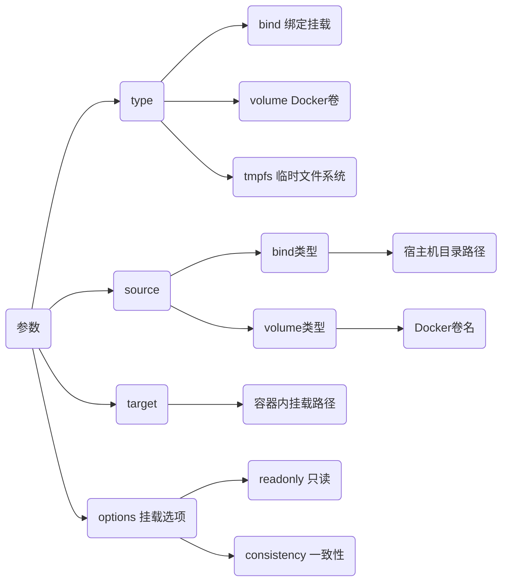
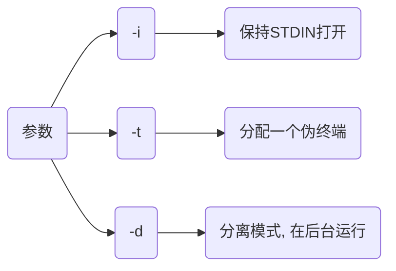

> [Docker 命令大全](https://www.runoob.com/docker/docker-command-manual.html)

## 生命周期管理

### run

创建并启动新容器, 可选择启动参数

```sh
docker run (启动参数) 镜像名
```

- 运行helloworld

```sh
docker run --rm hello_world
```

#### -itd

| 参数 |                  含义      |
| ---- | ------------------------- |
| `-i` | 以交互模式运行容器          |
| `-t` | 为容器重新分配一个伪输入终端 |
| `-d` | 后台运行并返回容器ID        |

- 以交互模式启动一个容器, 分配终端并让其后台运行

```sh
docker run -itd alpine
```

#### --name

给启动容器命名

```sh
--name=容器名
```

- 给新建容器命名为test

```sh
docker run -itd --name=test alpine
```

#### -p/--publish

将容器内部端口映射到宿主机端口，允许外部网络访问容器内部

````sh
-p 主机端口:容器端口
````

- 将主机7890端口映射至容器80端口, 外部可通过主机7890端口访问容器80端口

```sh
docker run -itd -p 7890:80 nginx
```

#### --net

指定容器网络连接类型

```sh
--net 网络类型
```

支持 bridge(默认), host, none, container四种类型

#### -e/--env

设置容器环境变量

```sh
-e 名称=值
```

- 设置mysql用户密码

```sh
docker run -itd -e MYSQL_ROOT_PASSWORD=123 mysql:5.6
```

- 设置环境变量STR_VEN值为abcdefg


#### -v/--volume

挂载本地目录或卷到容器内, 若本地目录不存在, 会自动创建文件夹

```sh
-v 宿主机目录:容器目录:(可选挂载选项, ro为只读, 默认rw读写权限)
```

#### --mount

挂载本地绝对路径到容器中

```sh
--mount type=挂载类型,source=挂载源,target=容器内挂载路径,(options)
```



- 将本地/Code 挂载到容器/Code

```sh
docker run -itd --mount type=bind,source="${HOME}/Code",target="/Code" busybox
```


### --restart

设置容器重启策略

`-restart=always` 使得容器在退出时总是重启

#### --privileged

给予容器内进程几乎与宿主机root用户等同的权限

#### --rm

容器退出后自动删除容器和其中的文件系统

### start/stop/restart

启动、停止和重启容器

#### start

```sh
docker start 容器名/ID
```

#### stop

```sh
docker stop 容器名/ID
```

### kill

立即终止一或多个正在运行容器

```sh
docker kill 容器名/ID
```

### rm

删除一或多个已经停止容器

#### 正常删除

```sh
docker rm 容器名/ID
```

- 强制删除

```sh
docker rm -f 容器名/ID
```

#### 批量删除

- 删除所有容器

```sh
docker rm $(docker ps -aq)
```

- 先停用删除

```sh
docker stop $(docker ps -aq) && docker rm $(docker ps -aq)
```

- 删除异常容器

```sh
docker rm $(docker ps -a | grep Exited | awk '{print $1}')
```

### pause/unpause

暂停和恢复容器中所有进程

### exec

在运行中容器内执行命令

```sh
docker exec (参数) 镜名/ID 命令
```



- busybox容器创建目录test


#### 多指令

```sh
docker exec (参数) 容器名/ID Shell解释器 -c '命令1 && 命令2'
```

- ubuntu安装mysql-clinet

```sh
docker run -itd --name=ubuntu_test ubuntu:18.04

docker exec -it ubuntu_test bash -c 'apt-get update && apt-get install -y mysql-client'
```

### rename

重命名容器

## 操作

### ps

列出容器

```sh
docker ps
```


第一列哈希值表示容器ID

#### 所有容器

```sh
docker ps -a
```

### inspect

获取docker对象(容器、镜像、卷、网络等)详细信息

#### IP地址

```sh
docker inspect 容器名/ID | grep IPAddress
```


#### 容器ID

```sh
$(docker ps | grep "容器名" | awk '{print $1}')

# 或者
$(docker ps -aqf "name=容器名")
```

| 参数 | 说明                  |
| ---- | -------------------- |
| a    | 即使容器没运行也能获取 |
| q    | 仅输出容器ID          |
| f    | filter               |

### export/import

- 打包容器

```sh
docker export 容器名/ID 压缩包.tar
```

- 加载容器

```sh
docker import 压缩包.tar 容器名/ID:tag
```

## 文件系统

### cp

用于宿主机与容器之间文件拷贝

#### 宿主机拷贝到容器

```sh
docker cp 宿主机路径 容器名/ID:容器内路径
```

#### 容器拷贝到宿主机

```sh
docker cp 容器名/ID:容器内路径 宿主机路径
```

### commit

将指定容器提交为镜像

```sh
docker commit -a (作者信息) -m (提交信息) 容器名/ID 目标镜像名:(tag)
```

- 将容器edf...提交为镜像l4d2_server:zc


### diff

显示docker容器文件系统变更

## docker-compose

TODO