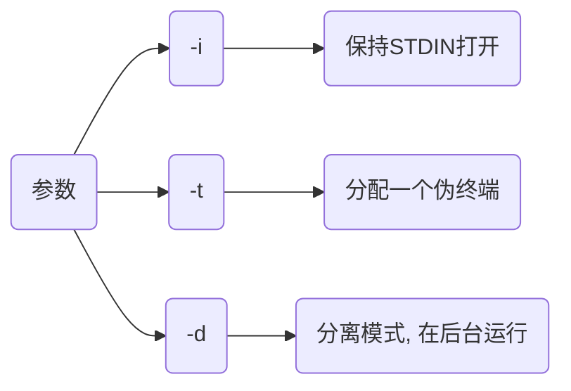

> [Docker 命令大全](https://www.runoob.com/docker/docker-command-manual.html)

# 容器命令

## 生命周期管理

### run

创建并启动新容器, 可选择启动参数

```sh
docker run (启动参数) [镜像名]
```

- 运行helloworld

```sh
docker run --rm hello_world
```

#### -itd

| 参数 | 含义                         |
| ---- | --------------------------- |
| `-i` | 以交互模式运行容器            |
| `-t` | 为容器重新分配一个伪输入终端   |
| `-d` | 后台运行并返回容器ID          |

- 以交互模式启动一个容器, 分配终端并让其后台运行

```sh
docker run -itd --name=test alpine
```

#### -p

将本地指定端口映射到容器指定端口

````sh
-p [主机端口]:[容器端口]
````

- 将宿主机7890端口映射至nginx容器80端口

```sh
docker run -itd -p 7890:80 --name=nginx_test nginx
```

访问本地7890端口就相当于访问容器80端口

#### -e

设置环境变量

```sh
-e 变量名=值
```

- 设置mysql用户密码为123

```sh
docker run -itd -e MYSQL_ROOT_PASSWORD=123 mysql:5.6
```

- 设置环境变量STR_VEN值为abcdefg


#### --mount

挂载**本地绝对路径**目录到容器中, 若目录不存在会报错, 默认权限读写, 可增加 `readonly` 指定为只读

```sh
--mount type=bind, source="本地绝对路径", target="容器路径",(readonly)
```

- 将本地/Code 挂载到容器/Code

```sh
docker run -itd --mount type=bind,source="${HOME}/Code",target="/Code" busybox
```


#### -v

挂载本地目录到容器中, 若本地目录不存在, 会自动创建文件夹

```sh
-v [本地目录]:[容器目录]
```

- 配置时区

```sh
-v /etc/localtime:/etc/localtime:ro
```

#### --net

指定容器网络连接类型

```sh
--net=[类型]
```

支持 bridge, host, none, container四种类型

### start/stop/restart

启动、停止和重启容器

#### start 

```sh
docker start [容器名]
```

#### stop

```sh
docker stop [容器ID]
```

### kill

立即终止一个或多个正在运行的容器

```sh
docker kill [容器ID]
```

### rm 

删除一个或多个已经停止容器

#### 正常删除

```sh
docker rm [容器ID]
```

#### 强制删除

```sh
docker rm -f [容器ID]
```

#### 删除所有容器

```sh
docker rm $(docker ps -aq)
```

#### 先停用删除

```sh
docker stop $(docker ps -aq) && docker rm $(docker ps -aq)
```

#### 删除异常容器

```sh
docker rm $(docker ps -a | grep Exited | awk '{print $1}')
```

### pause/unpause

暂停和恢复容器中所有进程

### create

创建一个新容器但不启动

### exec

在运行中容器内执行命令

```sh
docker exec [参数] 镜像ID {命令}
```



- busybox容器创建目录test


#### 多指令

```sh
docker exec [容器ID] [shell解释器] -c '命令1 && 命令2'
```

- ubuntu安装mysql-clinet

```sh
docker run -itd --name=ubuntu_test ubuntu:18.04

docker exec -it ubuntu_test bash -c 'apt-get update && apt-get install -y mysql-client'
```

### rename

重命名容器

## 操作

### ps

列出容器

```sh
docker ps
```


第一列哈希值表示容器ID

#### 所有容器

```sh
docker ps -a
```

### inspect

获取 Docker 对象(容器、镜像、卷、网络等)详细信息

#### IP地址

```sh
docker inspect [容器ID] | grep IPAddress
```


#### 容器ID

```sh
$(docker ps | grep "容器名" | awk '{print $1}')

或

$(docker ps -aqf "name=容器名")
```

| 参数 | 说明                    |
| ---- | ---------------------- |
| a    | 即使容器没运行也能获取   |
| q    | 仅输出容器ID            |
| f    | filter                 |

```sh
docker cp [容器ID]:[容器文件路径] [宿主机目标路径]
```

### export/import

- 打包容器

```sh
docker export [容器ID] > [压缩包.tar]
```

- 加载容器

```sh
docker import [压缩包.tar] [容器:tag]
```

## 文件系统

### cp

用于宿主机与容器内文件拷贝

#### 宿主机-->容器

```sh
docker cp [宿主机文件路径] [容器ID]:[容器目标路径]
```

#### 容器-->宿主机


### commit

将指定容器提交为镜像

```sh
docker commit -a [作者名] -m [提交信息] [容器ID] [镜像名]:[tag]
```

- 将容器edf...提交为镜像l4d2_server:zc


### diff

显示docker容器文件系统变更