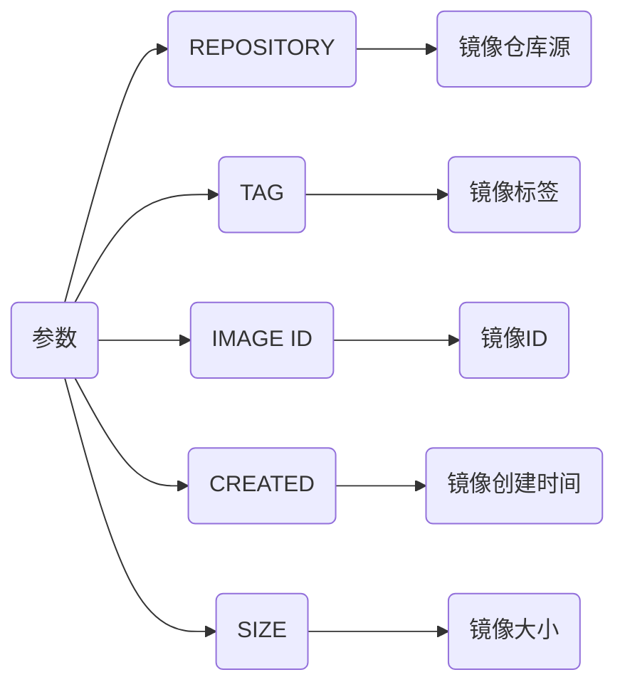
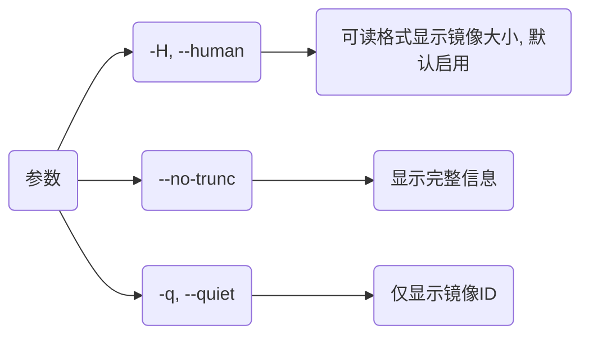
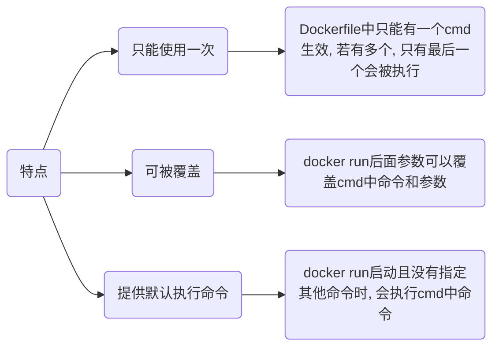
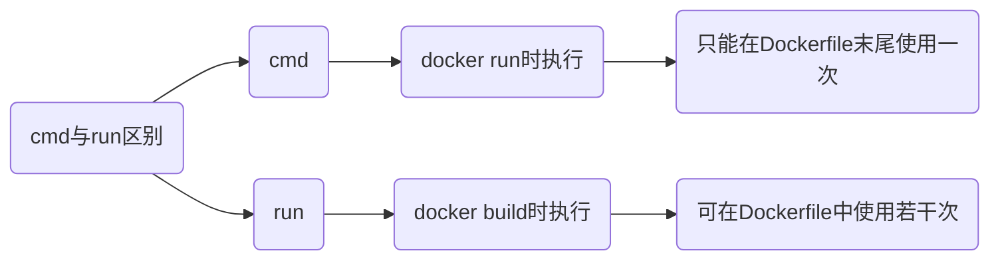

> [docker使用-将容器打成镜像](https://blog.csdn.net/weixin_45505313/article/details/125020076)

## 本地镜像

### images

列出本地镜像信息

```sh
docker images
```




### tag

创建本地镜像别名(tag)

```sh
docker tag 镜像ID 仓库:(tag)
```

### save

将一或多个docker镜像保存到归档文件

```sh
docker save 镜像名/ID -o 压缩包
```

- 示例, 将镜像self_image:v0.1保存为self.image.tar


### load

从压缩包中解压镜像文件

```sh
docker load -i 压缩包
```

- 示例, 解压self.image.tar

```sh
docker load -i self.image.tar
```


### rm

删除镜像

#### 正常镜像

```sh
docker rmi 容器名/ID
```

- 示例, 删除镜像test


#### none镜像

```sh
docker rmi -f $(docker images | grep '<none>' | awk '{print $3}') 
```

### history

查看镜像构建过程

```sh
docker history (参数) 容器名/ID
```



- 示例, 查看镜像gpp:v0.1


## 镜像仓库

### pull

从远程docker仓库中拉取镜像

```sh
docker pull (--platform 平台) 镜像名(版本, 默认latest)
```

- 示例, 拉取X86 busybox镜像

```sh
docker pull busybox
```


- 示例, 拉取arm gcc:12镜像

```sh
docker pull --platform linux/arm64 arm64v8/gcc:12
```


### push

将本地镜像推送到镜像仓库

## Dockerfile

Dockfile文件用于构建镜像

### from

`from`是 Dockerfile 中第一个非注释指令, 用于指定构建所用基础镜像

```docker
from (--platform=镜像平台) 镜像名(:tag)
```

#### 指定平台

- 指定ARM64 alpine镜像为原始镜像

```docker
from --platform=linux/arm64 alpine:latest
```

#### 多阶段构建

多阶段构建允许在单Dockerfile中使用多个from, 并且可以使用 as 为构建阶段命名

```docker
from 镜像名1 as 阶段名1
...

from 镜像名2 as 阶段名2
```

#### 支持变量

from指令支持由出现在首个from前任何 arg 指令声明变量

```docker
arg BASE_IMAGE_VERSION=latest
from ubuntu:${BASE_IMAGE_VERSION}
```

### workdir

设置工作目录(working directory), 即后续指令执行时默认目录

若指定相对路径, 则该路径将相对于容器内根目录(/)或之前通过 WORKDIR 设置目录

```docker
workdir 路径
```

- 示例, 设置工作路径

```docker
from alpine

# 设置工作目录 /app
workdir /app

run touch main.txt && mkdir code
```


#### 特点

(1) WORKDIR 指令可以在 Dockerfile 中出现多次, 每次都会更新当前工作目录

(2) 若指定目录不存在, 构建镜像时会自动创建

### run

在镜像构建过程中执行命令

```docker
run 指令 (参数1, 参数2,...)
```

`run`指令会在构建镜像时创建新层, 因此应尽量减少不必要使用, 缩减镜像大小

- 示例, 更新apt源

```docker
run apt udpate && \
    apt upgrade -y
```

- 示例, 安装设置python

```docker
# 安装 Python 和 pip
run apt-get update && \
    apt-get install -y python3 python3-pip

# 设置环境变量并安装 Python 依赖
run export PYTHONDONTWRITEBYTECODE=1 && \
    pip3 install --no-cache-dir -r requirements.txt
```

### copy

构建时将构建上下文目录中源路径文件/目录复制到镜像内目标路径

```docker
copy 源路径 目标路径
```

- 复制当前目录下所有文件到镜像工作路径

```sh
copy . .
```

#### 复制镜像文件

```
copy --from=镜像名 镜像中文件路径 目标路径
```

- 示例, 从nginx镜像中复制nginx.conf

```sh
copy --from=nginx:latest /etc/nginx/nginx.conf /nginx.conf
```

### add

用于将构建上下文中文件或目录添加到镜像文件系统中

`add`不仅可以添加, 还可自动解压压缩文件(如 .tar、.gz、.bz2、.xz 等), 以及支持从URL下载

```docker
add 源路径(压缩文件/网络文件) 目标路径
```

#### 添加文件

- 多文件

把 file1.txt 和 file2.txt 添加到/app下

```docker
add file1.txt file2.txt /app/
```

- 添加压缩文件并自动解压

把 archive.tar.gz 文件添加到镜像中, 并自动解压到 /app下

```docker
add archive.tar.gz /app/
```

- URL下载文件

从网络上下载文件, 添加到 /app下

```docker
add URL地址 /app/
```

### cmd

指定容器启动时要运行命令及其参数



#### shell格式

```docker
cmd 命令 参数1 参数2...
```

- 示例, 执行python指令

```docker
cmd python3 manage.py runserver 0.0.0.0:8000
```

#### exec格式

```docker
cmd ["命令", "参数1", "参数2", ...]
```

- 示例, 执行python指令

```docker
cmd ["python3", "manage.py", "runserver 0.0.0.0: 8000"]
```



## 构建镜像

```sh
docker build (-f Dockerfile文件) -t 目标镜像名(:tag) .
```

### 单阶段

#### 单Dockerfile

若当前目录仅单Dockerfile

```sh
docker build -t 目标镜像名(:tag) .
```

- 示例, 构建g++镜像

```dockerfile
# Dockerfile
from alpine as builder
workdir /
run sed -i 's/dl-cdn.alpinelinux.org/mirrors.aliyun.com/g' /etc/apk/repositories && \
    apk update &&                                                                   \
    apk add g++
```

```sh
docker build -t gpp:v1 .
```


#### 多Dockerfile

设当前目录存在Dockerfile.dev, Dockerfile.master, 通过`-f`参数指定Dockerfile

```sh
docker build -f Dockerfile名 -t 目标镜像名(:tag) .
```

### 多阶段

多阶段构建可使用多`from`, 方便在构建过程中从不同镜像中提取特定数据, 减少最终镜像体积

#### 连续构建

- 示例, 多阶段构建go程序

```go
# app.go
package main

import "fmt"
func main(){
    fmt.Printf("Hello World!");
}
```

```docker
# Dockerfile
# 第一阶段
from golang:1.9-alpine as builder
workdir /go/src/github.com/go/helloworld/
copy app.go .
run apk --no-cache add git                                          && \
    go get -d -v github.com/go-sql-driver/mysql                     && \
    CGO_ENABLED=0 GOOS=linux go build -a -installsuffix cgo -o app .

# 第二阶段
from alpine:latest as prod
workdir /root/
# 从第一阶段中拷贝文件
copy --from=builder /go/src/github.com/go/helloworld/app .
run apk --no-cache add ca-certificates
cmd ["./app"]
```

#### 仅构建某阶段

```sh
docker build --target=阶段名 -t 目标镜像名(:tag) .
```

### 交叉构建

可在X86设备上构建ARM镜像

#### 配置QEMU

```sh
docker run --rm --privileged multiarch/qemu-user-static --reset -p yes
```


- --rm

容器停止后自动删除

- --privileged

给予root权限, 容器运行时需要访问宿主机硬件或内核功能时设置

- multiarch/qemu-user-static

镜像名称, 该镜像包含QEMU用户模式模拟的用户空间二进制文件, 其允许在A架构宿主机上运行B构二进制文件

- --reset

重置之前为当前系统架构配置的QEMU用户模式二进制文件

- -p yes

通知qemu-user-static探测当前系统架构, 并自动配置适当QEMU用户模式二进制文件, yes参数确认操作

#### 拉取镜像

```sh
docker pull --platform 平台名 镜像名
```

- 示例, 拉取ARM alpine镜像

```sh
docker run --platform linux/arm64 alpine uname -m
```


#### 执行

```sh
docker build (--platform 架构) -t 镜像名(:tag) .
```

- 示例, 构建arm64平台镜像

```docker
# Dockerfile
from --platform=linux/arm64 alpine:latest

run sed -i 's/dl-cdn.alpinelinux.org/mirrors.aliyun.com/g' /etc/apk/repositories && \
    apk update && apk add gcc
```

```sh
docker build --platform linux/arm64 -t alpine_gcc:arm64 .
```


#### 查看

```sh
docker inspect --format '{{.Architecture}}' 镜像名
```

- 示例, 查看上面构建alpine_gcc:arm64镜像

