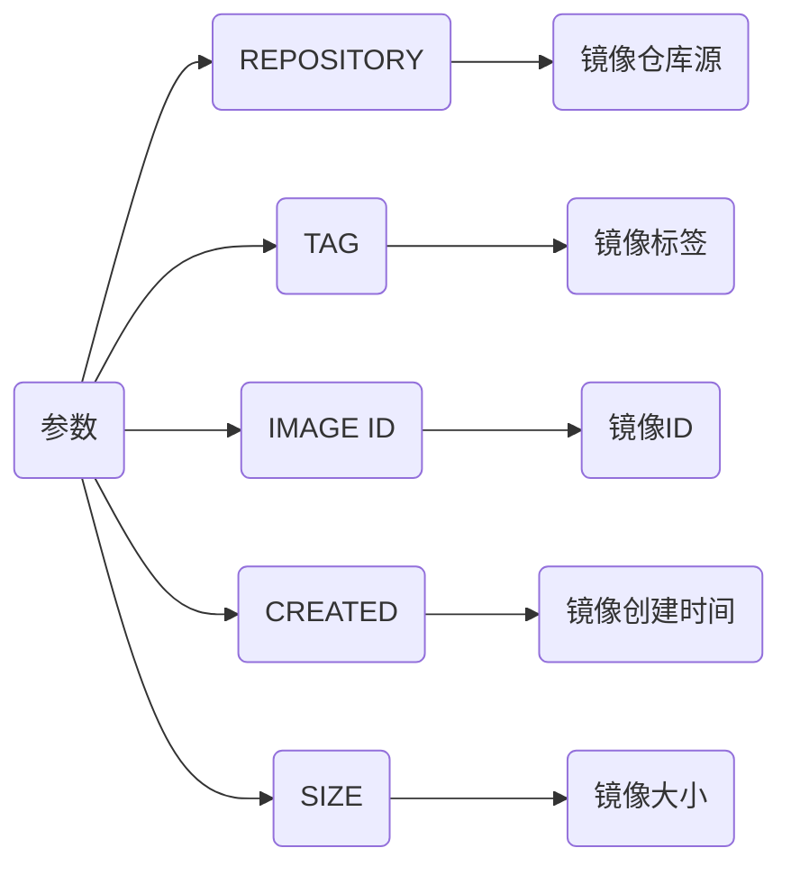
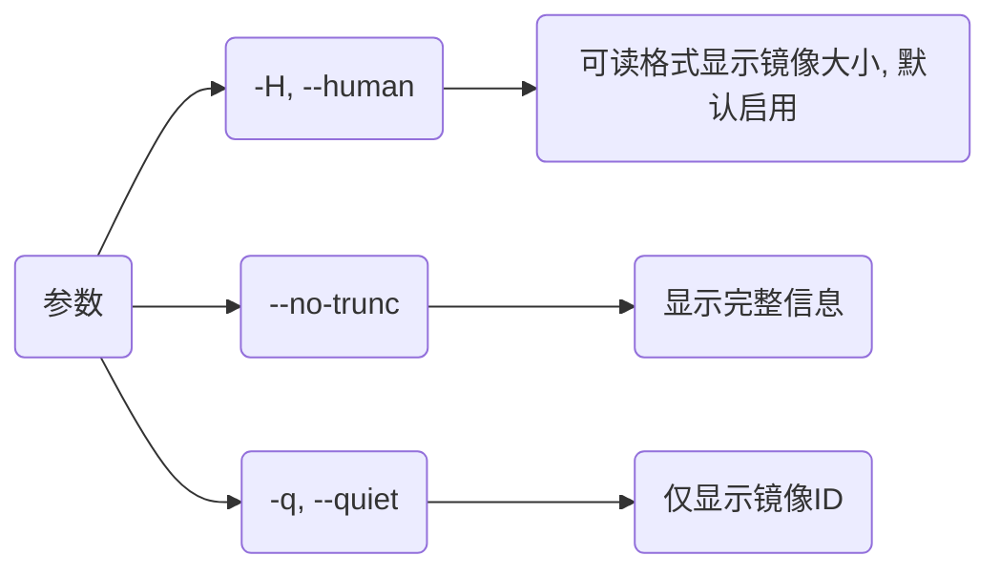

> [docker使用-将容器打成镜像](https://blog.csdn.net/weixin_45505313/article/details/125020076)

## 本地镜像

### images

列出本地镜像信息

```sh
docker images
```




### tag

创建本地镜像别名(tag)

```sh
docker tag 镜像ID 仓库:(tag)
```

### save

将一或多个docker镜像保存到归档文件

```sh
docker save 镜像名/ID -o 压缩包
```


### load

从压缩包中解压镜像文件

```sh
docker load -i 压缩包
```

- 解压python3.7-apline.tar

```sh
docker load -i python3.7-apline.tar
```


### rm

删除镜像

#### 正常镜像

```sh
docker rmi 容器名/ID
```


#### none镜像

```sh
docker rmi -f $(docker images | grep '<none>' | awk '{print $3}') 
```


### history

```sh
docker history (参数) 容器名/ID
```



## 镜像仓库

### pull

从远程docker仓库中拉取镜像

```sh
docker pull (平台) 镜像名(版本, 默认latest)
```

- 拉取X86 busybox镜像

```sh
docker pull busybox
```


- 拉取arm gcc镜像

```sh
docker pull --platform linux/arm64 arm64v8/gcc:9
```


### push

TODO