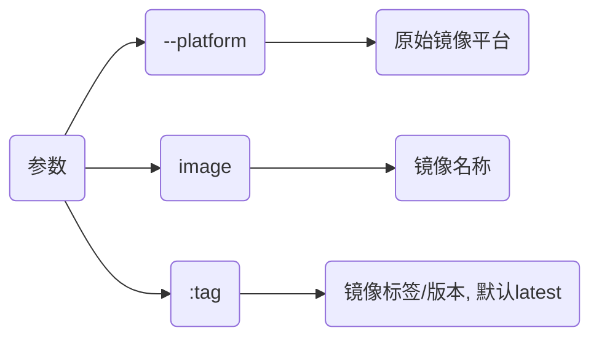
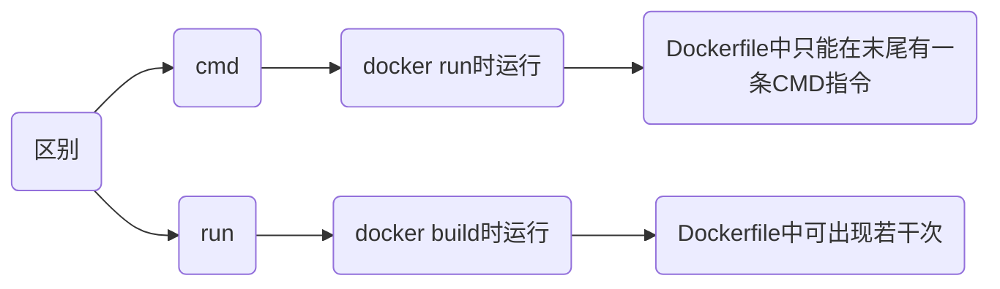

## Dockerfile

Dockfile文件用于构建镜像

### from

`from`指定构建镜像的基础镜像

每个Dockerfile都必须以`from`开头, 基础镜像可以是官方 Docker 镜像、其他开源镜像

```docker
from (--platform=<platform>) <image>(:tag)
```



- 指定使用ARM架构Alpine镜像作为原始镜像

```docker
from --platform=linux/arm64 alpine:latest
```

#### 多阶段构建

多阶段构建可\使用多`from`, 方便在构建过程中从不同镜像中提取特定数据, 减少最终镜像体积

```docker
# 第一阶段, 构建应用程序
from node:14 as builder
workdir /app
copy . .
run npm install && npm run build

# 第二阶段, 构建最终的生产镜像
from nginx:alpine
# 从第一阶段中复制文件
copy --from=builder /app/build /usr/share/nginx/html
```

### workdir

设置工作路径

```docker
workdir 路径
```

### run

构建时执行指令

```docker
run 指令
```

- 构建时执行更新源命令

```docker
run apt udpate && apt upgrade -y
```

### copy

`copy` 将构建上下文目录中源路径文件/目录复制到镜像内目标路径/位置

```docker
copy (--from=镜像名) 源路径 目标路径
```

- 复制当前目录下所有文件到镜像工作路径

```sh
copy . .
```

- 复制nginx镜像中nginx.conf文件

```sh
copy --from=nginx:latest /etc/nginx/nginx.conf /nginx.conf
```

### add

复制文件功能与`copy`一致, 额外拥有拷贝网络文件及解压压缩文件功能

```docker
add <源路径(压缩文件/网络文件)> <目标路径>
```

若源路径为tar压缩文件且压缩格式为 gzip, bzip2, xz, `add` 将会自动解压缩文件到目标路径

### cmd

#### shell格式

```docker
cmd 命令
```

- 执行Python指令

```docker
cmd python3 manage.py runserver 0.0.0.0:8000
```

#### exec格式

```docker
cmd ["execute", "arg1", "arg2", ...]
```

- 执行python指令

```docker
cmd ["python3", "manage.py", "runserver 0.0.0.0: 8000"]
```



## 构建

```sh
docker build (-f Dockerfile文件) -t 镜像名(:tag) .
```

### 单阶段

#### 单Dockerfile

- 当前目录仅单Dockerfile

```sh
docker build -t 镜像名(:tag) .
```

#### 多Dockerfile

- 当前目录存在Dockerfile.dev, Dockerfile.master

通过`-f`参数指定Dockerfile

```sh
docker build -f Dockerfile.dev -t 镜像名(:tag) .
```

- 构建g++镜像

Dockerfile

```dockerfile
from alpine as builder
workdir /

run sed -i 's/dl-cdn.alpinelinux.org/mirrors.aliyun.com/g' /etc/apk/repositories && \
    apk update && apk add g++
```

```sh
docker build -t gpp:v1 .
```


### 多阶段构建

#### 连续构建

```docker
from 镜像名1 as 阶段名1
...
from 镜像名2 as 阶段名2
```

- 多阶段构建go语言可执行程序

App.go

```go
package main

import "fmt"
func main(){
    fmt.Printf("Hello World!");
}
```

Dockerfile

```docker
# 第一阶段
from golang:1.9-alpine as builder
workdir /go/src/github.com/go/helloworld/

run apk --no-cache add git
run go get -d -v github.com/go-sql-driver/mysql

copy App.go .

run CGO_ENABLED=0 GOOS=linux go build -a -installsuffix cgo -o App .

# 第二阶段
from alpine:latest as prod
workdir /root/

run apk --no-cache add ca-certificates

# 从第一阶段中拷贝文件
copy --from=builder /go/src/github.com/go/helloworld/App .

cmd ["./App"]
```

#### 仅构建某阶段

```sh
docker build --target=阶段名 -t 新镜像名(:tag) .
```

- 仅构建 builder 阶段镜像

```sh
from golang:1.9-alpine as builder

···

docker build --target=builder -t only_builder:v1 .
```

### 交叉构建

#### 配置QEMU

```sh
docker run --rm --privileged multiarch/qemu-user-static --reset -p yes
```

运行multiarch/qemu-user-static, 以重置或配置QEMU用户模式模拟的二进制文件, 使其能在不同架构容器中运行


- --rm

容器停止后自动删除, 可以避免留下冗余容器, 节省系统资源

- --privileged

给予容器几乎等同于宿主机root权限, 通常设置给运行时需要访问宿主机硬件或内核功能的容器

- multiarch/qemu-user-static

镜像名称, multiarch/qemu-user-static镜像包含QEMU用户模式模拟的用户空间二进制文件, 其允许在A架构宿主机上运行B构二进制文件

- --reset

重置之前为当前系统架构配置的QEMU用户模式二进制文件

若之前为不同架构配置QEMU, 且现在想要清除配置时使用

- -p yes

通知qemu-user-static探测当前系统架构, 并自动配置适当QEMU用户模式二进制文件, yes参数确认操作

#### 启用Buildx(可选)

docker-buildx是docker插件, 交叉构建时可同时生成多平台镜像

```sh
sudo apt install docker-buildx
```

- 查看版本

```sh
docker buildx version
```


- 查看是否启用

```sh
docker buildx ls
```


#### 拉取镜像

```sh
docker pull --platform linux/arm64 镜像名
```

- 验证镜像架构

```sh
docker run --platform linux/arm64 alpine uname -m
```


#### 执行构建

```sh
docker (buildx) build (--platform 架构1, 架构2...) -t 镜像名(:tag) .
```

- 构建ARM64 alpine

```docker
# Dockerfile
from --platform=linux/arm64 alpine:latest

run sed -i 's/dl-cdn.alpinelinux.org/mirrors.aliyun.com/g' /etc/apk/repositories
run apk update && apk add gcc
```

```sh
docker build --platform linux/arm64 -t alpine_gcc:arm64 .
```


- 同时构建AMD64, ARM64 alpine镜像

```sh
docker buildx build --platform linux/amd64, linux/arm64 -t alpine_gcc:arm64 .
```

#### 查看

```sh
docker inspect --format '{{.Architecture}}' 镜像名
```

