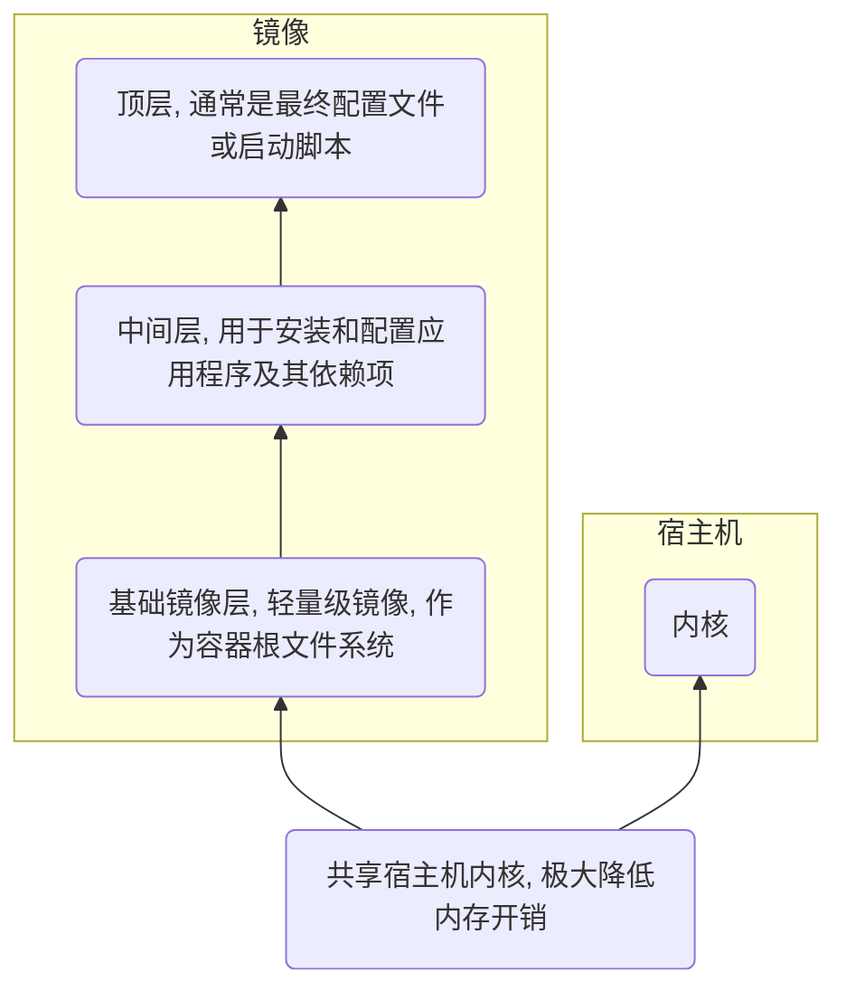

## 安装

### windows

安装Docker-Desktop

### linux

#### ubuntu

- 更新安装依赖

```sh
sudo apt-get update

sudo apt-get install -y ca-certificates curl gnupg lsb-release
```

- 添加GPG密钥

```sh
curl -fsSL https://mirrors.aliyun.com/docker-ce/linux/ubuntu/gpg | sudo gpg --dearmor -o /usr/share/keyrings/docker-archive-keyring.gpg
```

- 设置docker仓库地址添加到源

```sh   
echo "deb [arch=$(dpkg --print-architecture) signed-by=/usr/share/keyrings/docker-archive-keyring.gpg] https://mirrors.aliyun.com/docker-ce/linux/ubuntu $(lsb_release -cs) stable" | sudo tee /etc/apt/sources.list.d/docker.list > /dev/null
```

- 更新包索引并安装

安装docker引擎、docker CLI和 containerd.io

```sh
sudo apt-get update

sudo apt-get install -y docker-ce docker-ce-cli containerd.io
```

- 启动

安装完成启动docker服务

```sh
sudo systemctl start docker
sudo systemctl enable docker

# 或者
sudo service docker start
sudo service docker enable
```

验证docker版本

```sh
docker --version
```


## 配置

### 软件

#### 镜像加速

编辑/etc/docker/daemon.json文件, 添加

```json
{
    "builder": {
        "gc": {
            "defaultKeepStorage": "20GB",
            "enabled": true
        }
    },
    "experimental": false,
    "registry-mirrors": [
        "https://docker.hpcloud.cloud",
        "https://docker.m.daocloud.io",
        "https://docker.unsee.tech",
        "https://docker.1panel.live",
        "http://mirrors.ustc.edu.cn",
        "https://docker.chenby.cn",
        "http://mirror.azure.cn",
        "https://dockerpull.org",
        "https://dockerhub.icu",
        "https://hub.rat.dev"
    ]
}
```

重启服务

```sh
sudo systemctl daemon-reload
sudo systemctl restart docker
```

#### 非root用户运行

默认情况下, 只有root用户和docker组用户才能运行docker命令

为避免每次都用sudo, 可将当前用户添加到docker组,

```sh
sudo usermod -aG docker $USER
```

添加之后注销或重启宿主机

### 命令

#### 启动

```sh
systemctl start docker

# 或者
service docker start
```

#### 重启

```sh
systemctl restart docker

# 或者
service docker restart
```

#### 查看版本

```sh
docker version
```

#### 清理构建缓存

```sh
docker builder prune
```

## 概念

### 镜像

docker镜像是一种轻量级、可执行软件包, 包含运行某个应用或服务所需所有代码、运行时环境、系统工具、库文件和设置, 可被docker引擎读取并用来创建和运行容器实例

#### 组成

- 文件系统层

(1) 根文件系统

应用程序运行时所需根文件系统映像, 包括二进制文件、库文件和配置文件等, 其共同构成镜像基础运行环境

(2) 镜像层

docker镜像采用分层结构, 每个镜像都由一系列镜像层组成, 这些层通过UnionFS(联合文件系统)技术叠加在一起, 形成一个完整文件系统

每个层都包含对根文件系统增量更改, 使镜像存储和更新更加高效

- 元数据

(1) Manifest文件

JSON格式, 描述镜像内容、大小和标签等元数据, 是镜像核心组成部分, 包含镜像构建历史和层信息

(2) 配置文件

指定容器运行时配置信息, 如入口点(entrypoint)、环境变量(environment variables)和卷(volumes)等

配置信息决定容器在启动时行为和状态

(3) 标签

用于组织和标识镜像元数据键值对, 通过标签可以方便地管理和查找镜像

- 网络设置

docker镜像可以包含网络设置信息, 如IP地址和端口映射等, 在容器启动时会被docker引擎读取并应用到容器上, 从而实现容器与外部网络通信

- 用户和组

镜像中可以指定容器内进程所运行用户和组信息, 通过用户ID(UID)和组ID(GID)表示, 用于控制容器内进程权限和访问控制

- 命令

(1) 入口点(Entrypoint)

容器启动时所执行命令, 是容器运行起点, 定义容器启动后要所执行主进程

(2) CMD

入口点默认参数, 指定Entrypoint后, CMD中参数会被传递给Entrypoint命令作为执行参数

#### 镜像层(image layer)

docker镜像由一系列镜像层(image layers)组成, 镜像层通过UnionFS(联合文件系统)技术叠加在一起, 形成一个完整文件系统

每个镜像层都包含指向其父层指针, 用于访问父层数据, 以及唯一ID标识符, 用于识别管理



- 可写层

docker容器启动时会在镜像最顶层添加一个可写层(容器层), 容器中所有更改(如文件写入、删除等)都会发生在可写层中, 而不影响到下面镜像层

可写层能通过`docker commit`转换为只读层

UnionFS允许docker将多个镜像层叠加在一起, 形成一个统一文件系统视图

- 只读层

除最顶层的容器层外, 所有镜像层都只读, 一旦镜像被创建, 其各个层内容就不能被修改

#### 镜像层机制

- 创建

每个Dockerfile指令都会创建一个新层

- 缓存

docker会缓存每个层的构建结果, 若Dockerfile中指令没有变化, docker会重用先前构建结果

- Copy-on-Write

容器需要修改文件时, docker不会直接修改底层镜像文件, 而是会在可写层创建一个文件副本, 进行修改

这种策略确保底层镜像不可变性, 同时提高容器性能和安全性

### 容器

docker容器基于镜像创建, 是镜像运行实例, 类似于类与对象关系

镜像由一系列层组成, 运行镜像时docker会从底向上读取层, 并在最上层创建一个新可写层, 作为容器运行时工作空间

容器 = 镜像 + 可写层

#### 运行态容器(running container)

运行态容器表示容器当前正在执行, 已启动并正运行应用程序或服务

运行态容器中包含一或多个正在运行进程, 其在容器启动时由docker守护进程创建、负责管理和监控

- 组成

运行状态容器由一个可读写文件系统与隔离进程空间和进程构成

- 进程隔离

运行状态容器内进程运行在一个与宿主机和其他容器隔离进程空间中, 通过namespace和Cgroups等特性实现

- 进程管理

容器内进程由docker守护进程负责创建、监控和终止

### 相关技术

#### namespace

为容器内进程提供独立系统视图, 包括文件系统、网络、用户ID等, 使得容器内进程看起来像是在一个独立操作系统环境中运行

#### cgroup

用于限制容器内进程资源(如CPU、内存等), 以确保不会消耗过多系统资源