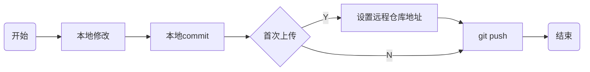
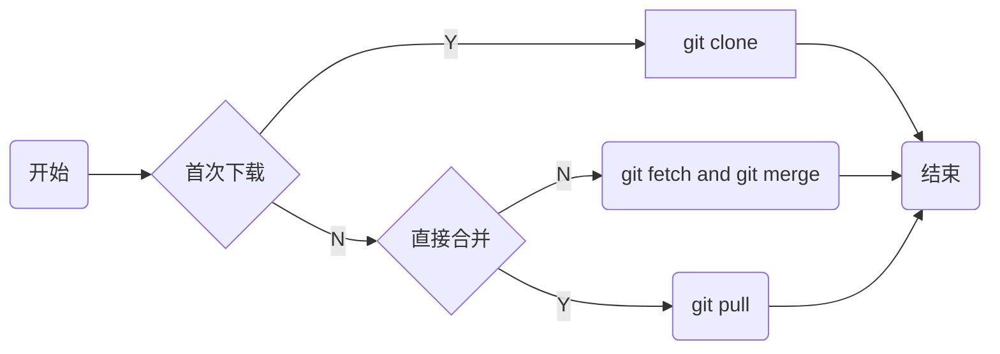

> [Git中文显示编码问题解决](https://cuiqingcai.com/9997.html)

# 使用

## 下载

[Git客户端官网下载链接](https://git-scm.com/downloads)


## 配置

### 查看

- 查看系统配置

```sh
git config --system --list
```


- 查看当前用户(global)配置

```sh
git config --global  --list
```

### 修改

#### 用户信息

- 配置用户名(必须)

```sh
git config --global user.name "用户名"
```

- 配置邮箱(必须)

```sh
git config --global user.email "邮箱"
```

#### 设置

- 配置编辑器

```sh
git config --global core.editor "code -w"
```

- 防止中文乱码

```sh
git config --global core.quotepath false
```

- 启用文件大小写敏感

```sh
git config --global core.ignorecase false
```

## 本地使用

假设本地新建项目git_demo

```sh
git init
```


随便新建一个Hello.md文件

```md
# Hello World
```

- 提交

```sh
git add .
```

```sh
git commmit -m "初次提交"
```

本地部分完成


## github使用

### 设置

首先需要注册一个github账号, 并且登录

#### 配置公钥

github设置公钥后, 上传下载即可免输入密码

打开本地用户目录下.ssh目录id_rsa.pub, 复制值


### 上传



设目的是把本地git_demo项目上传到github仓库上

#### 新建项目

设github上新建项目git_demo


创建后发现github已经贴心提供上传指令


#### 首次上传

假设是首次上传已存在项目

```sh
# 修改分支名为min
git branch -M main

# 添加远程仓库
git remote add origin git@github.com:[替换实际仓库]/git_demo.git

# 首次上传
git push -u origin main
```

注意, 提交时若提示需要配置用户名与邮箱, 则需进行配置


后续提交时, 本地修改后直接使用`git push`推送到远程仓库即可

### 下载

将github上项目下载(更新)到本地



#### 首次下载

```sh
git clone [仓库名]
```


#### 后续更新

假设仓库进行修改, 现在想同步到本地


- 直接更新

```sh
git pull
```


### PR

TODO

## 搭建git服务

选择开源gogs

### 配置

#### Docker部署

```sh
docker run -itd --name=self_gogs -p 10022:22 -p 3000:3000 gogs/gogs
```

访问http://ip:3000地址, 出现下图安装界面


注意下图中填写端口地址均为本地映射端口


### 使用

#### 建立用户

建立用户User_A


#### 建立仓库


#### 推送

- 本地拉取

```sh
git clone http://192.168.3.3:13000/UserA/GogsTest.git
```


本地建立Main.c文件

```c
#include <stdio.h>
int main(void) {
    printf("Hello World\n");
    return 0;
}
```

- 提交

输入建立的用户与密码


