> [廖雪峰git教程](https://liaoxuefeng.com/books/git/introduction/index.html)
> [Git 如何移除一个子模块](https://geek-docs.com/git/git-questions/26_git_how_do_i_remove_a_submodule.html)

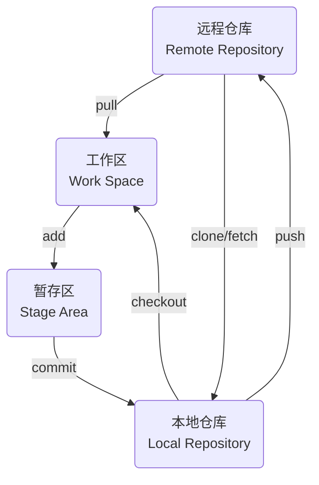

## 版本管理

### 初始化

初始化本地仓库, 执行后自动创建.git目录, 用于管理版本库

```sh
git init
```


### 状态

#### 查看

查看仓库中文件状态

```sh
git status
```

新建Main.cpp位于工作区, 查看状态, 红色表示该文件未添加至暂存区


#### 添加暂存区

将文件由工作区添加至暂存区, 参数<文件名>为`.`表示全部文件

```sh
git add <文件名>
```

查看状态, 绿色表示该文件已添加进暂存区


#### 撤回

将已添加至暂存区文件撤回至工作区

```sh
git restore --staged <文件名>
```


### 提交

将暂存区文件提交至本地仓库, 并附加提交信息

```sh
git commit (-m "commit信息")
```

#### 查看

查看每次提交记录, 包含信息有commit ID、作者、提交时间

```sh
git log
```


#### 修改

假设commit后发现提交信息有误, 进行修改

- 修改最近一次 `commit`

```sh
git commit --amend
```

### 回退

设原始Main.cpp

```c++
#include<iostream>
int main() {
    std::cout << "[Master] Hello World" << std::endl;
    return 0;
}
```

设修改后Main.cpp

```c++
#include<iostream>
int main() {
    std::cout << "[Update] Hello World" << std::endl;
    return 0;
}
```

#### 未暂存回退

适用于已修改, 还未添加至暂存区(未执行`git add`)回退

- 指定文件回退, 文件名为`.`时表示全部文件

```sh
git checkout -- 文件名
```

修改Main.cpp后, 在未添加到暂存区时回退, 文件恢复至修改前状态


#### 已暂存回退

适用于已修改, 并已添加到暂存区(已执行`git add`)回退

- 回退指定文件修改

```sh
git reset HEAD 文件名
```

- 回退所有修改

```sh
git reset
```

`git reset`只撤回添加操作, 不撤回文件修改


#### 已commit退回

适用于已修改并已commit回退

git中用`HEAD` 表示当前提交, 上个版本表示为`HEAD^`, 前100个版本表示为`HEAD~100`

- reset --hard

删除工作空间改动, 撤销`git commit`, 撤销`git add .`

```sh
# 回退到上次commit
git reset --hard HEAD^

# 回退到任意版本
git reset --hard 某次commit_id
```

修改后再次提交


回退至上次commit后, 暂存区和工作区均会回到上次提交时状态, 所有自上次后修改全被恢复


- reset --soft

不删除工作空间改动, 撤销`git commit`, 不撤销`git add .`

```sh
git reset --soft HEAD^
```

修改后再次提交


回退至上次commit, 修改后文件仍在暂存区, 且修改后内容未删除


- reset --mixed

不删除工作空间改动, 撤销`git commit`, 并撤销`git add .`

```sh
git reset --mixed HEAD^
```

修改后再次提交


回退至上次commit, 修改后的文件仍在工作区, 且修改后内容未删除


## 分支

每次提交git串成一条时间线, 表示一个分支

创建仓库时默认创建master(main)分支, 后续也可手动创建

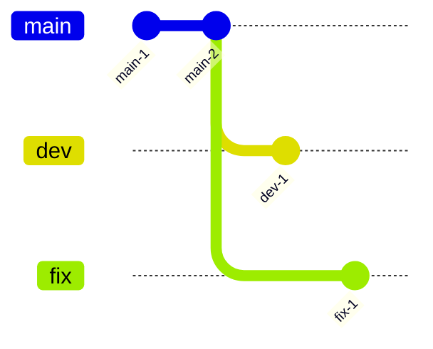

### 查看

#### 查看当前分支

```sh
git branch
```


#### 查看远程分支

```sh
git branch -r
```

#### 查看所有分支

```sh
git branch -a
```

### 修改

#### 创建分支并切换

```sh
git switch -c 分支名
```

- 创建dev分支并切换


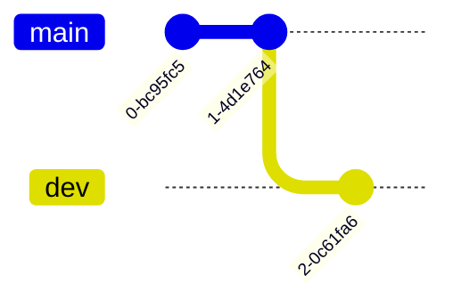

#### 切换分支

```sh
git switch 分支名
```


#### 重命名

重命名当前分支为新名称

```sh
git branch -M 新分支名
```

### 删除

```sh
git branch -d 分支名
```

- 删除dev分支


## 合并

合并代码时分两种情况,

(1) 完全合并, 需要另一个分支所有变动, 采用`git merge`

(2) 选择合并, 只需要部分变动(某几次提交), 采用`git cherry-pick`

### 完全合并

```sh
git merge
```

#### 合并A分支到B分支

```sh
git switch B分支

git merge A分支
```

- 将dev分支合并到master分支


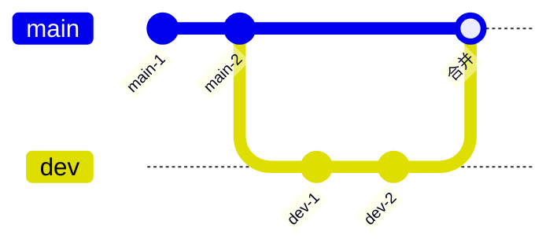

#### 解决冲突

两个分支合并时可能会出现文件冲突错误

设有文件Main.cpp

```c
#include<iostream>
int main() {
    std::cout << "Hello World" << std::endl;
    return 0;
}
```

设在master分支上修改, 并commit

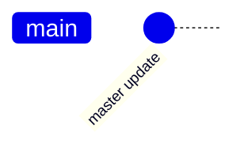

之后创建dev分支, 修改(dev)Main.cpp, 并commit

```c
#include<iostream>
int main() {
    std::cout << "[Dev] Hello World" << std::endl;
    return 0;
}
```


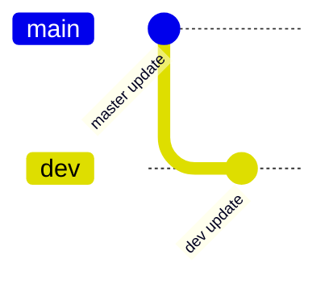

切换回master分支, 再修改(master)Main.cpp, 并提交

```c
#include<iostream>
int main() {
    std::cout << "[Fix Master] Hello World" << std::endl;
    return 0;
}
```


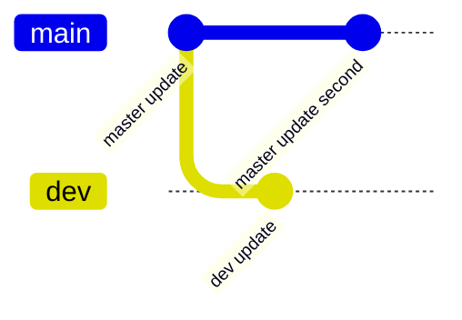

将dev分支合并到master分支, 提示冲突


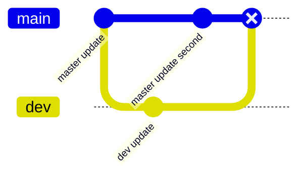

(master)Main.cpp显示

```c
#include<iostream>
int main() {
<<<<<<< HEAD
    std::cout << "[Fix Master] Hello World" << std::endl;
=======
    std::cout << "[dev] Hello World" << std::endl;
>>>>>>> dev
    return 0;
}
```

`<<<<<<<` 与 `>>>>>>>` 表示当前修改与传入修改, 需自主选择保留

设保留双方更改, 修改后提交, 冲突解决

```c
#include<iostream>
int main() {
    std::cout << "[Fix Master] Hello World" << std::endl;
    std::cout << "[dev] Hello World" << std::endl;
    return 0;
}
```


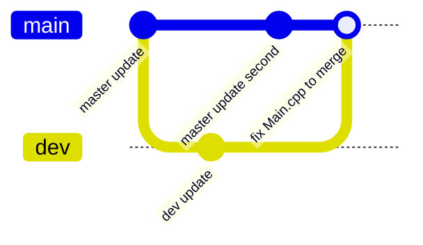

### 选择合并

`git cherry-pick`可理解为"挑拣"提交, 其选择某个分支单次/多次提交, 并作为新提交引入到当前分支

```sh
git cherry-pick 某次commit id
```

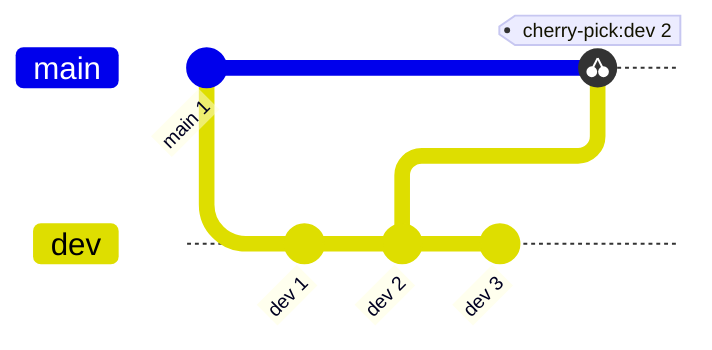

## 标签

标签(tag)用于给特定提交(commit)打标记, 用于记录项目开发过程中重要里程碑或发布版本

### 创建

#### 指定commit打标签

参数\<commit id>为空时表示最新commit

```sh
git tag 标签名 (某次commit id)
```

- 以最新commit打标签


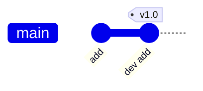

- 以commit 5fb451b.. 打标签


#### 添加描述信息

```sh
git tag -a 标签名 -m 描述信息 某次commit_id
```

### 删除

#### 删除本地tag

```sh
git tag -d 标签名
```

- 删除tag v0.9


#### 删除远程tag

```sh
git push origin :refs/tags/标签名
```

### 查看

```sh
git tag
```


## 远程仓库
 
### 克隆

```sh
git clone 仓库地址 (存放路径)
```

设克隆github上克隆仓库到本地


#### 默认路径


#### 指定路径

- 克隆到当前目录


- 克隆到任意目录


### 查看

```sh
git remote -v
```


### 修改

#### 删除远程仓库

- 按名称删除

```sh
git remote rm 远程分支名
```

- 按URL删除

```sh
git remote set-url --delete origin 远程仓库地址
```

#### 添加

```sh
git remote add 远程主机名 远程仓库地址
```

### 拉取

`git pull` 将远程主机最新内容拉下来后直接合并

可能会产生冲突, 需手动解决

```sh
git pull 远程主机名 远程分支名:本地分支名
```

#### 直接拉取合并

拉取远程仓库master分支内容

```sh
git pull origin master
```

若远程分支是与当前分支合并, 则可简写为`git pull`

- 无冲突情况

设远程仓库master分支存在修改, 本地master分支直接拉取


- 有冲突情况

设远程仓库master分支与本地master分支都修改了Main.cpp

直接`git pull`会提示冲突, 按照教程中解冲突步骤处理后提交即可


#### 拉取后手动合并

`git pull`过程可分解为, 

(1) 通过`git fetch`从远程主机将远程最新内容拉到本地, 用户可决定是否合并到本地分支中

```sh
git fetch 远程主机名 远程分支名
```

取回更新后, 会返回`FETCH_HEAD`, 指某个分支在服务器上最新状态

通过`git log -p FETCH_HEAD`查看更新文件名、作者和时间、代码, 可以通过这些信息来判断是否产生冲突

(2) 通过`git merge`将拉取下来最新内容合并到当前所在分支中

```sh
git merge FETCH_HEAD
```

- 冲突情况处理

假设本地master分支与远程master分支都修改了Main.cpp, 执行拉取后手动合并

执行`git fetch`, 并查看更新内容


执行`git merge`, 提示冲突


按照教程中解冲突步骤处理后提交即可


本地和远程分支已一致


### 推送

`push` 将本地分支版本上传到远程并合并

```sh
git push 远程主机名 本地分支名:远程分支名
```

设存在远程仓库`http://192.168.3.3:13000/UserA/Test.git`

设本地创建GitTest目录仓库, 创建Main.cpp文件

#### 推送已创建仓库

```sh
git remote add origin 仓库地址

git push origin 分支
```

- 将本地仓库master分支推送到远程仓库master分支


#### 普通推送

```sh
git push 远程主机名 本地分支名:远程分支名
```

- 在master分支修改Main.cpp, commit后推送到远程仓库

若本地分支与远程分支一致, 则可简写为`git push`


#### 推送本地分支到远程分支

建立本地到上游(远端)仓链接

```sh
git branch --set-upstream-to=origin/分支

git push origin 分支
```

- 本地建立dev分支并上传到远程


#### 推送标签

```sh
git push origin master --tags
```

- 本地master分支建立tag:v0.1并上传


#### 同时推送到多仓库

添加多个远程仓库地址

```sh
git remote set-url --add origin 远程仓库地址
```

现在就可一次`push`到多个库

## 子模块

### 查看

```sh
git submodule
```


### 添加

```sh
git submodule add 子模块仓库地址
```


### 修改

#### 克隆

- 同时拉取子模块

使用`--recursive`参数在克隆项目同时拉取子模块

```sh
git clone --recursive 项目地址
```


- 手动拉取子模块

若克隆项目时未拉取子模块, 可在主项目根目录手动拉取

```sh
git submodule init

git submodule update
```

#### 更新

主项目根目录中, 更新子模块以获取最新改动

```sh
git submodule update --remote
```

#### 提交

子模块修改完毕后, 与普通项目提交方式一致

### 删除

#### 移除子模块

```sh
git submodule deinit -f 子模块本地路径
```

#### 删除子模块目录

```sh
git rm 子模块本地路径
```

- 移除Imgur子模块


