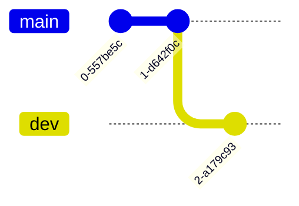

> [廖雪峰git教程](https://liaoxuefeng.com/books/git/introduction/index.html)
> [Git 如何移除一个子模块](https://geek-docs.com/git/git-questions/26_git_how_do_i_remove_a_submodule.html)

## 概念


### 工作区

工作区(Work Space)是指在本地文件系统中存储库目录, 可理解为在本地计算机上存放源代码目录

#### 作用

用户可在工作区进行代码编辑、添加、修改和删除等操作, 所有文件最新修改都体现在工作区中

#### 状态

- 已修改(Modified), 表示文件已修改, 但还未提交到版本库中

- 已暂存(Staged), 表示文件已修改, 并且已添加到暂存区, 准备提交到版本库

- 已提交(Committed), 表示文件已提交到版本库

### 暂存区

暂存区(Staging Area)是.git目录下名为index的文件, 本质是数据库

#### 作用

暂存区是暂存改动的缓冲地带, 其分离工作区与版本库的交互, 使得工作区中更改不会立即进入版本库, 而是先进入暂存区

### 本地仓库

本地仓库是在开发人员自己电脑上git仓库, 包含项目全部提交历史

#### 作用

本地仓库用于存储本地工作区和暂存区变更(新增、修改、删除)文件

对工作区中文件修改, 并提交到暂存区和本地仓库后, 更改就永久保存在本地仓库历史记录中

### 远程仓库

远程仓库是在远程服务器git仓库, 用于存储备份、共享和协同工作代码

#### 作用

远程仓库允许团队成员将本地更改推送到远程仓库, 并从远程仓库拉取其他成员更改

#### 操作

- 克隆(clone), 将远程仓库复制到本地

- 推送(push), 将本地仓库更改上传到远程仓库

- 拉取(pull), 将远程仓库更改下载到本地仓库

## 版本管理

### 初始化

初始化本地仓库, 执行后自动创建.git目录, 用于管理版本库

```sh
git init
```


#### 状态

查看文件状态

```sh
git status
```

#### 修改

修改文件, 查看, 红色表示文件位于工作区并已修改


#### 撤销

- 撤销工作区内文件修改

将文件恢复到上一次提交状态

```sh
git restore 文件名
```

- 撤销工作区内文件删除

从上一次提交中恢复被删除文件到工作区

```sh
git checkout -- 文件名
```

### 添加

将工作区文件添加至暂存区, 文件名为`.`表示全部文件

```sh
git add 文件名
```


绿色表示文件已添加暂存区

#### 撤回

将已添加至暂存区文件撤回至工作区

```sh
git restore --staged 文件名
```


### 提交

将暂存区文件提交至本地仓库

```sh
git commit (-m "commit信息")
```

#### 查看

查看每次提交记录, 包含commit ID、作者、提交时间信息

```sh
git log
```


#### 修改

设commit后发现提交信息有误, 进行修改

- 示例, 修改最近一次 `commit`

```sh
git commit --amend
```

### 回退

设原始Main.cpp

```c++
#include<iostream>
int main() {
    std::cout << "[Master] Hello World" << std::endl;
    return 0;
}
```

设修改后Main.cpp

```c++
#include<iostream>
int main() {
    std::cout << "[Update] Hello World" << std::endl;
    return 0;
}
```

#### 未暂存回退

适用于已修改未添加至暂存区(未执行`git add`)回退

- 指定文件回退, 文件名为`.`时表示全部

```sh
git checkout -- 文件名
```

修改Main.cpp后, 在未添加到暂存区时回退, 文件恢复至修改前状态


#### 已暂存回退

适用于已修改已添加到暂存区(已执行`git add`)回退

- 回退指定文件

```sh
git reset HEAD 文件名
```

- 回退所有修改

```sh
git reset
```

注意, `git reset`只撤回添加操作, 不撤回文件修改


#### 已commit退回

适用于已修改并已commit回退

git中用`HEAD` 表示当前提交, 上个版本表示为`HEAD^`, 前100个版本表示为`HEAD~100`

- reset --hard

删除工作空间改动, 撤销`git commit`, 撤销`git add .`

```sh
# 回退到上次commit
git reset --hard HEAD^

# 回退到任意版本
git reset --hard 某次commit_id
```

修改后再次提交


回退至上次commit后, 暂存区和工作区均会回到上次提交时状态, 所有自上次后修改全被恢复


- reset --soft

不删除工作空间改动, 撤销`git commit`, 不撤销`git add .`

```sh
git reset --soft HEAD^
```

修改后再次提交


回退至上次commit, 修改后文件仍在暂存区, 且修改后内容未删除


- reset --mixed

不删除工作空间改动, 撤销`git commit`, 并撤销`git add .`

```sh
git reset --mixed HEAD^
```

修改后再次提交


回退至上次commit, 修改后的文件仍在工作区, 且修改后内容未删除


## 分支

git分支允许你在代码库中创建多个开发线

每个分支本质上都是代码库一个快照, 可在不影响其他分支的情况下独立进行开发和修改


### 查看

#### 查看当前分支

创建仓库时默认创建master(main)分支

```sh
git branch
```


#### 查看远程分支

```sh
git branch -r
```

#### 查看所有分支

```sh
git branch -a
```

### 创建

#### 仅创建分支

```sh
git branch 分支名
```

#### 创建分支并切换

```sh
git switch -c 分支名
```

- 示例, 创建dev分支并切换




### 修改

#### 切换分支

```sh
git switch 分支名
```


#### 重命名

重命名当前分支

```sh
git branch -M 新分支名
```

### 删除

```sh
git branch -d 分支名
```

- 示例, 删除dev分支


## 合并

合并代码时分两种情况,

- 完全合并, 需要另一个分支所有变动, 采用`git merge`

- 选择合并, 只需要部分变动(某几次提交), 采用`git cherry-pick`

### 完全合并

```sh
git merge 待合并分支名
```

#### 合并A分支到B分支

```sh
git switch B分支

git merge A分支
```

- 将dev分支合并到master分支


#### 解决冲突

两个分支合并时可能会出现文件冲突错误

设有文件Main.cpp

```c
#include<iostream>
int main() {
    std::cout << "Hello World" << std::endl;
    return 0;
}
```

设在master分支上修改提交


之后创建dev分支, 修改(dev)Main.cpp提交

```c
#include<iostream>
int main() {
    std::cout << "[Dev] Hello World" << std::endl;
    return 0;
}
```


切换回master分支, 再修改(master)Main.cpp提交

```c
#include<iostream>
int main() {
    std::cout << "[Fix Master] Hello World" << std::endl;
    return 0;
}
```


将dev分支合并到master分支, 提示冲突


(master)Main.cpp显示

```c
#include<iostream>
int main() {
<<<<<<< HEAD
    std::cout << "[Fix Master] Hello World" << std::endl;
=======
    std::cout << "[dev] Hello World" << std::endl;
>>>>>>> dev
    return 0;
}
```

`<<<<<<<` 与 `>>>>>>>` 表示当前修改与传入修改, 为发生冲突处

设保留双方更改, 修改后提交, 冲突解决

```c
#include<iostream>
int main() {
    std::cout << "[Fix Master] Hello World" << std::endl;
    std::cout << "[dev] Hello World" << std::endl;
    return 0;
}
```


### 选择合并

`git cherry-pick`可理解为"挑拣"提交, 其选择某个分支单次/多次提交, 并作为新提交引入到当前分支

```sh
git cherry-pick 某次commit_id
```


#### 流程

(1) 切换到目标分支, 执行cherry-pick

(2) 解决冲突(如果有)

如果在cherry-pick过程中遇到冲突, git会暂停操作, 并要求手动解决冲突

```sh
# 解决冲突后, 添加解决后文件到暂存区
git add <conflicted-file>

# 继续cherry-pick
git cherry-pick --continue
```

(3) 放弃cherry-pick(如果需要)

```sh
# 撤销cherry-pick操作
git cherry-pick --abort
```

#### 应用多个提交

按顺序逐一应用提交到当前分支上

```sh
git cherry-pick commit-hash1 commit-hash2 commit-hash3
```

#### 应用范围提交

可指定提交范围应用

```sh
git cherry-pick start-commit-hash^..end-commit-hash
```

## 标签

标签(tag)标记特定提交(commit), 用于记录项目开发过程中重要里程碑或发布版本

### 创建

#### 指定commit作标签

```sh
git tag 标签名 (某次commit_id, 为空表示最新commit)
```

- 示例, 以最新commit打标签


- 示例, 以commit 5fb451b.. 打标签


#### 添加描述信息

```sh
git tag -a 标签名 -m 描述信息 某次commit_id
```

### 删除

#### 删除本地tag

```sh
git tag -d 标签名
```

- 示例, 删除tag v0.9


#### 删除远程tag

```sh
git push origin :refs/tags/标签名
```

### 查看

```sh
git tag
```


## 远程仓库

远程仓库通常位于远程服务器, 如GitHub、GitLab、Bitbucket或Gitee等代码托管平台

### 克隆

通过克隆可将远程仓库内容复制到本地, 创建一个与之相同本地仓库

```sh
git clone 仓库地址 (存放路径)
```

设克隆github上克隆仓库到本地


#### 默认路径


#### 指定路径

- 克隆到当前目录


- 克隆到任意目录


### 查看

```sh
git remote -v
```


### 删除

#### 按名称删除

```sh
git remote rm 远程分支名
```

#### 按URL删除

```sh
git remote set-url --delete origin 远程仓库地址
```

### 添加

```sh
git remote add 远程主机名 远程仓库地址
```

### 拉取

`git pull` 从远程仓库获取更新, 使本地仓库保持同步

```sh
git pull 远程主机名 远程分支名:本地分支名
```

#### 直接合并

拉取远程仓库某分支内容, 可能会产生冲突, 需手动解决

```sh
git pull origin 远程分支名
```

若远程分支是与当前分支合并, 可简写为`git pull`

- 无冲突情况

设远程仓库master分支存在修改, 本地master分支直接拉取


- 有冲突情况

设远程仓库master分支与本地master分支都修改同个文件

直接`git pull`会提示冲突, 解冲突后提交


#### 手动合并

`git pull`过程可分解为,

(1) 通过`git fetch`从远程主机将远程最新内容拉到本地, 用户可决定是否合并到本地分支中

```sh
git fetch 远程主机名 远程分支名
```

取回更新后, 会返回`FETCH_HEAD`, 指某个分支在服务器上最新状态

通过`git log -p FETCH_HEAD`查看更新文件名、作者和时间、代码, 可以通过这些信息来判断是否产生冲突

(2) 通过`git merge`将拉取下来最新内容合并到当前所在分支中

```sh
git merge FETCH_HEAD
```

- 冲突情况处理

假设本地master分支与远程master分支都修改Main.cpp, 执行拉取后手动合并

执行`git fetch`, 并查看更新内容


执行`git merge`, 提示冲突


解冲突后提交


本地和远程分支已一致


### 推送

`git push` 将本地分支更改上传到远程仓库

```sh
git push 远程主机名 本地分支名:远程分支名
```

设存在远程仓库`http://192.168.3.3:13000/UserA/Test.git`

设本地创建GitTest目录仓库, 创建Main.cpp文件

#### 推送已创建仓库

```sh
git remote add origin 仓库地址

git push origin 分支
```

- 示例, 将本地仓库master分支推送到远程仓库master分支


#### 推送本地分支到远程仓库

```sh
git push 远程主机名 本地分支名:远程分支名
```

若本地分支与远程分支一致, 则可简写为`git push`

示例在master分支修改Main.cpp提交, 推送到远程仓库


- 设置跟踪关系(可选)

为在以后的推送中不再每次指定远程分支名, 可使用-u(或--set-upstream)标志来设置跟踪关系

```sh
git push -u 远程仓库名 本地分支名
```

设置跟踪关系后, 后续只需调用`git push`即可将更改推送到所关联远程分支

- 同时推送到多仓库

添加多个远程仓库地址

```sh
git remote set-url --add origin 远程仓库地址
```

现在就可一次`push`到多个库

#### 推送本地标签

```sh
git push origin 分支名 --tags
```

- 示例, 本地master分支建立tag:v0.1并上传


## 子模块

git子模块(Git Submodules)允许将一个git仓库作为另一个git仓库的子目录


### 查看

```sh
git submodule
```


### 添加

```sh
git submodule add 子模块仓库地址 (子模块路径)
```


### 初始化

#### 自动拉取

使用`--recursive`参数在克隆项目同时拉取子模块

```sh
git clone --recursive 项目地址
```


#### 手动拉取

若克隆项目时未拉取子模块, 可在主项目根目录手动拉取

```sh
git submodule init

git submodule update
```

### 修改

#### 更新

更新子模块以获取最新改动

```sh
git submodule update --remote
```

#### 提交

子模块修改后, 与普通项目提交方式一致

### 删除

#### 移除子模块

```sh
git submodule deinit -f 子模块本地路径
```

#### 删除子模块目录

```sh
git rm 子模块本地路径
```

- 示例, 移除Imgur子模块

