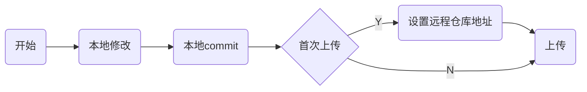

# 使用

## 配置

### 账号注册

首先需要注册一个github账号, 并且登录

### 配置公钥

打开本地用户目录下.ssh目录id_rsa.pub, 复制值


#### github配置

设置公钥后, 上传下载即可免输入密码


## 上传



设把本地git_demo项目上传到github上


### 本地修改

#### 初始化

本地新建文件夹git_demo

```sh
git init
```


随便新建一个Hello.md文件

```md
# Hello World
```

#### 提交

```sh
git add .
```

```sh
git commmit -m "初次提交"
```

本地部分完成


### 远程仓库

#### 新建项目

假设github上新建项目git_demo


github已经贴心提供了上传指令


#### 首次提交

假设是首次提交, 且是已存在项目

```sh
# 修改分支名为min
git branch -M main

# 添加远程仓库
git remote add origin git@github.com:[替换实际仓库]/git_demo.git

# 首次上传
git push -u origin main
```

注意, 提交时若提示需要配置用户名与邮箱, 则需进行配置


后续提交时, 本地修改后直接使用`git push`推送到远程仓库即可

## 下载

### 首次下载

```sh
git clone [仓库名]
```

将github上仓库下载到本地


### 后续更新

假设目前仓库进行了修改, 此处仅为示例


#### 直接更新

```sh
git pull
```

