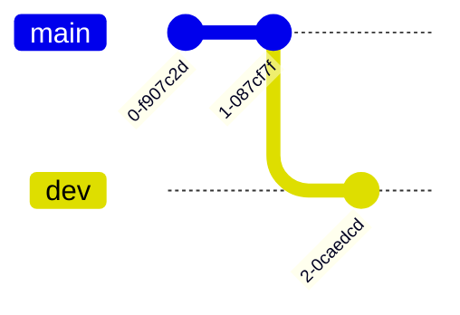
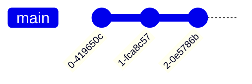

# git操作


## 配置

- 配置用户名

```sh
git config --global user.name "用户名"
```

- 配置邮箱

```sh
git config --global user.email "邮箱"
```

- 配置编辑器

```sh
git config --global core.editor "code -w"
```

- 防止中文乱码

```sh
git config --global core.quotepath false
```

### 创建公钥

```sh
ssh-keygen -t rsa -C "邮箱"
```

公钥位置`.ssh/id_rsa.pub`

### .git优化

```sh
git gc --prune=now

git rev-list --objects --all | grep "$(git verify-pack -v .git/objects/pack/*.idx | sort -k 3 -n | tail -5 | awk '{print$1}')"
```

## init

### 新建代码仓库

- 当前目录

```sh
git init
```

- 指定目录

```sh
git init 项目名
```


### 查看文件状态

```sh
git status
```

## add

### 添加

- 添加所有文件到暂存区

```sh
git add .
```

### 撤回

- 撤回暂存区文件

```sh
# 默认所有文件, 也可指定文件
git reset HEAD
```


## branch

### 查看当前分支

```sh
git branch
```



### 查看所有分支

```sh
git branch -a
```


### 建立分支

```sh
git branch [分支名]
```

### 删除分支

```sh
git branch -d [分支名]
```

## checkout

### 切换指定分支

```sh
git checkout [分支名]
```

### 创建新分支并切换

```sh
git checkout -b 分支名
```

## commit



将暂存区里的改动给提交到本地的版本库

### 注释

- 使用编辑器添加注释

```sh
git commit
```

- 直接添加注释

```sh
git commit -m "注释"`
```


### 修改

- 修改最近一次 `commit`

```sh
git commit --amend
```

若修改已经`push`到远程分支, 则push时需加`--force-with-lease`参数

```sh
git push --force-with-lease
```

## reset

### --mixed(默认)

`不删除`工作空间改动代码, 撤销`commit`, 并撤销`git add .`

```sh
git reset --mixed HEAD^ 或

git reset HEAD^
```

- 修改倒数第三条commit

```sh
git reset -i HEAD~3
```

### --soft

`不删除`工作空间改动代码, 撤销`commit`, 不撤销`git add .`

```sh
git reset --soft HEAD^
```

### --hard

`删除`工作空间改动代码, 撤销`commit`, 撤销`git add .`

完成操作后就恢复到了上一次的commit状态

```sh
git reset --hard HEAD^
```

## merge

### 合并dev至main分支

```sh
git checkout main

git merge [dev分支]
```


## pull

`git pull` 将远程主机的最新内容拉下来后直接合并, 可能会产生冲突, 需手动解决

```sh
git pull [远程主机名] [远程分支名]:[本地分支名]
```

若远程分支是与当前分支合并, 则冒号后部分可省略

```sh
git pull origin master
```

### fetch

`git fetch` 将远程的最新内容拉到本地, 用户在检查了以后决定是否合并到本地分支中

```sh
git fetch 远程主机名 远程分支名
```

取回origin主机的master分支

```sh
git fetch origin master
```

取回更新后, 会返回一个`FETCH_HEAD`, 指的是某个`branch`在服务器上的最新状态.

- 查看更新的文件名, 作者和时间, 代码

```sh
git log -p FETCH_HEAD
```

可以通过这些信息来判断是否产生冲突, 以确定是否将更新merge到当前分支

### 原理

`git pull`的过程可分解为

从远程主机的分支拉取最新内容

```sh
git fetch origin 远程分支名
```

将拉取下来的最新内容合并到当前所在的分支中

```sh
git merge FETCH_HEAD
```

## push

`push` 将本地的分支版本上传到远程并合并

```sh
git push [远程主机名] [本地分支名]:[远程分支名]
```

### 上传本地分支到远程分支

建立本地到上游(远端)仓的链接

```sh
git branch --set-upstream-to=origin/[分支]

git push origin [分支]
```

## remote

### 查看远程仓库

```sh
git remote -v
```

### 删除远程仓库

- 名称

```sh
git remote rm [远程分支名]
```

- URL

```sh
git remote set-url --del origin [远程 URL]
```

### 添加仓库地址

```sh
git remote add [远程用户名] [远程 URL]
```

#### 添加多仓库地址

```sh
git remote set-url --add origin [远程 URL]
```

此时`git push origin master` 就可一次性`push`到多个库