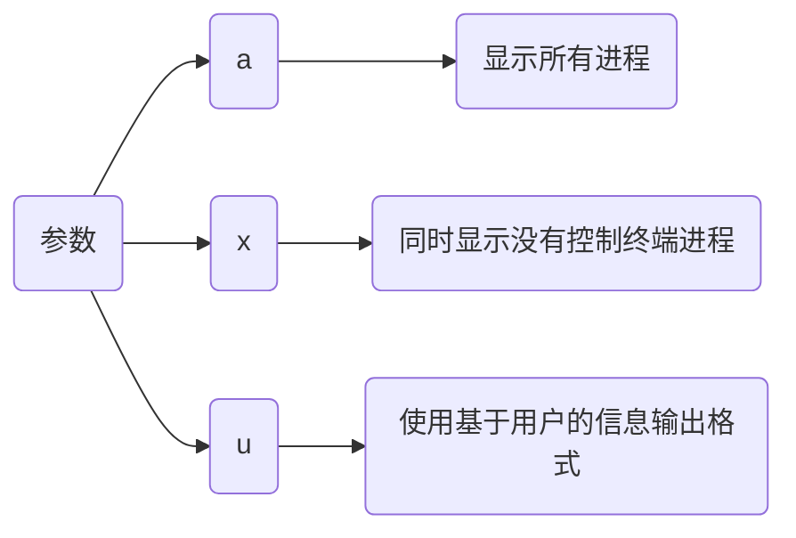
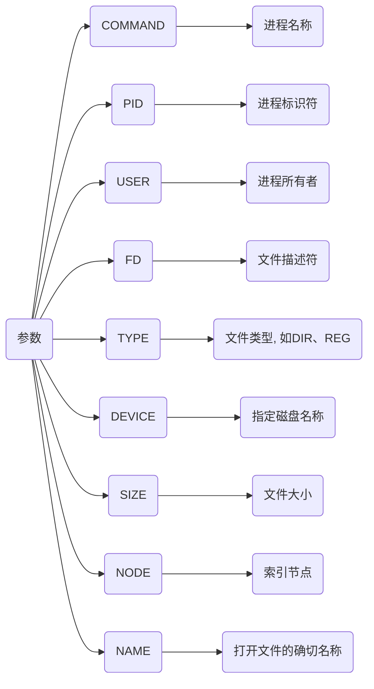

# 进程指令

## ps

```sh
ps -aux
```




- 查看指定进程pid

```sh
ps -aux | grep 进程名
```

其中带中括号的命令(如 [kthreadd])并不是真正的命令而是内核线程

- 查看指定端口

```sh
ps -ef | grep 端口号
```

## lsof

```sh
lsof -i:端口号
```




```sh
netstat -tunlp | grep [端口号]
```


## nohup

no hang up(不挂起), 用于在系统后台不挂断地运行命令, 退出终端不会影响程序的运行

默认情况(非重定向)时, 会输出nohup.out到当前目录, 若当前目录nohup.out文件不可写, 则输出重定向到${HOME}/nohup.out文件

```sh
nohup command [arg...] &
```

| 参数    | 含义                         |
| ------- | --------------------------- |
| command | 要执行的命令                 |
| arg     | 一些参数, 可以指定输出文件    |
| &       | 让命令在后台或终端退出后仍执行 |

后台运行jenkins.war包

```sh
nohup java -jar jenkins.war --httpPort=8080 &

# 查看后台任务
jobs

# 将第一个任务调至前台
fp %1
```


## 前后台进程

- 前台进程

交互式进程, 由某个终端会话创建和控制, 需要用户控制, 不能作为系统服务自动启动

- 后台进程

非交互式进程, 不和终端绑定的进程, 不等待用户输入

| 指令        | 效果                                                 |
| ----------- | --------------------------------------------------- |
| 命令后加`&` | 后台执行命令, 可通过 jobs 查看当前任务                 |
| fg %n       | 将后台执行的第n个进程调到前台执行                      |
| ctrl + Z    | 将一个正在前台执行的命令放到后台, 并处于暂停状态不可执行 |
| bg          | 让前台程序后台继续执行                                |

后台运行Python进程

```sh
python -m SimpleHTTPServer &

# 使用jobs查看后台进行的任务
jobs

# 将后台执行的第一个任务调到前台执行
fg %1

# 使用 Ctrl + Z 组合键(发送 STOP 信号)停止当前进程
^z

# 使用 bg 命令将进程调至后台继续执行
bg
```

