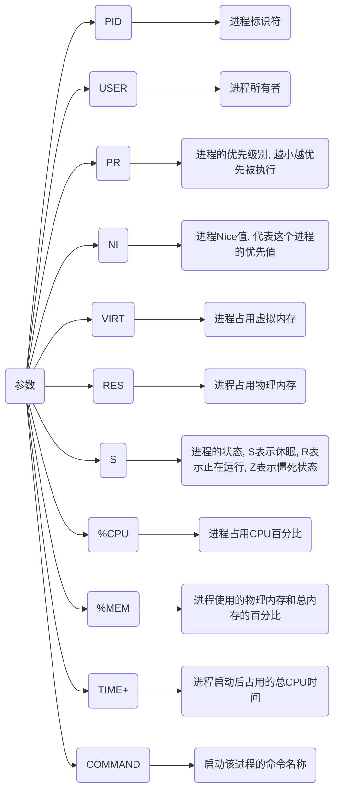

# 内存指令

## top

```sh
top 
```




## free

```sh
free [参数]
```


从应用程序的角度来说: available = free + buff/cache

| 参数 | 含义               |
| ---- | ------------------ |
| 空   | 用KB为单位展示数据 |
| -m   | 用MB为单位展示数据 |
| -g   | 用GB为单位展示数据 |

| 参数       | 含义                  |
| ---------- | -------------------- |
| total      | 总计物理内存的大小     |
| used       | 已使用内存的大小       |
| free       | 可用内存的大小         |
| shared     | 多个进程共享的内存总额  |
| buff/cache | 磁盘缓存大小           |
| available  | 可用内存大小           |

### 清理内存

```sh
sudo sh -c "echo [参数] > /proc/sys/vm/drop_caches"

# sudo sh -c "echo 3 > /proc/sys/vm/drop_caches"
```

| 参数 | 含义                                   |
| ---- | ------------------------------------- |
| 0    | 系统默认值, 表示不释放内存, 由OS自动管理 |
| 1    | 释放页缓存                             |
| 2    | 释放dentries和inodes                   |
| 3    | 释放所有缓存                           |
