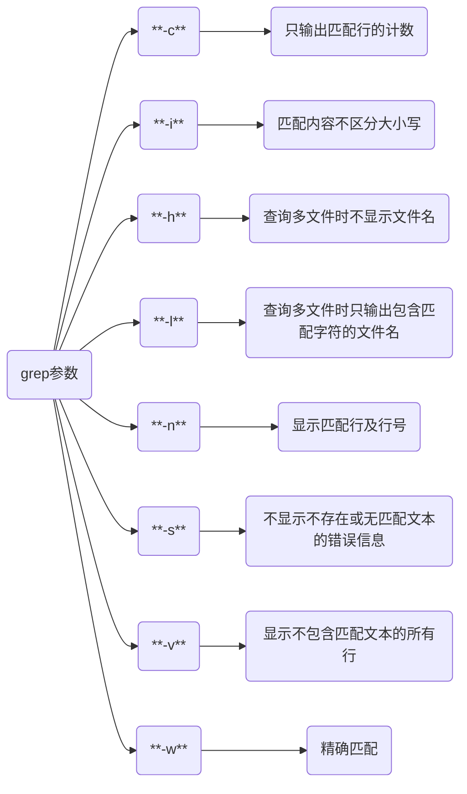
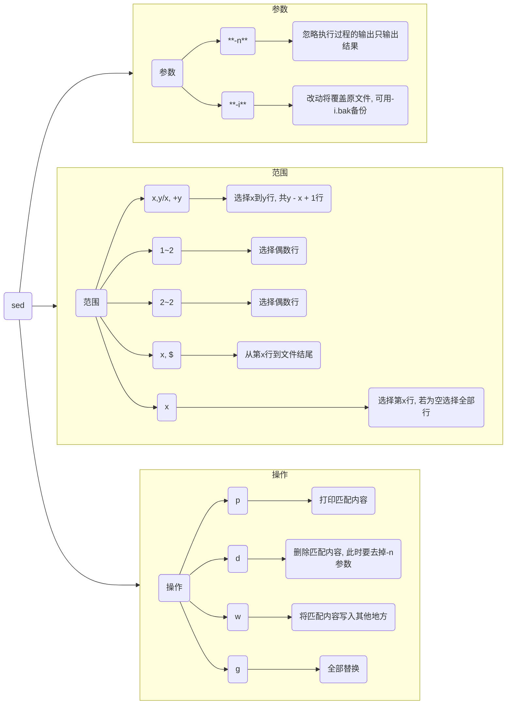

# 文本指令

## awk

将文件逐行读入, 以空格为默认分隔符将每行切片, 再对切开的部分进行各种分析处理

```sh
awk [参数] '{pattern action}' {文件名}
```

| 参数    | 含义                                 |
| ------- | ----------------------------------- |
| pattern | awk 在数据中查找的内容               |
| action  | 在找到匹配内容时执行的命令            |
| {}      | 用于根据特定的模式对一系列指令进行分组 |

- 查看登录的用户名

```sh
last -n 5 | awk '{print $1}'
```


## grep

```sh
grep -[参数] 匹配项
```



### 单查询

#### 模糊匹配

含有匹配项的字段都会匹配

```sh
grep (模式) [匹配项]
```

```sh
# 匹配结果为abc abcd abcdef
grep "abc"
```

#### 精确匹配

```sh
grep -w [匹配项]
```

```sh
# 结果为abc
grep -w "abc"
```

### 与查询

在前一个查询的结果中继续查询

```sh
grep '模式1' [匹配项] | grep '模式2'
```

- 查询3月10日16点30时间段内的ssh登录成功的情况

```sh
grep 'Mar 10 16:3' /var/log/secure | grep Accepted
```


### 或查询

```sh
grep '模式1|模式2' [匹配项] 或 

grep -E '模式1|模式2' [匹配项]
```

### 非查询

去除包含模式1的进程行, 避免影响最终数据的正确性

```sh
grep -v 模式1 [匹配项]
```

- 查询VLC进程信息时排除grep本身影响
  
```sh
ps -aux | grep vlc | grep -v grep
```


### 正则

#### 查看以pattern开头的行

```sh
grep ^pattern
```

#### 查找以pattern结尾的行

```sh
grep pattern$
```

- 查找/root/test.txt文件中含有human的句子

```sh
grep human /root/test.txt
```


- 查找/root/test.txt文件中以The开头的句子

```sh
grep ^The /root/test.txt
```


## sed

```sh
sed -参数 '起始范围, 结束范围 操作' 路径
```



### 打印

若字符串中带有路径符号 `/`, 可以用 `#` 分隔

- 打印file.txt 1-5行
  
```sh
sed -n '1, 5 p' file.txt
```

### 添加

#### 第一行前添加

```sh
sed -i '1i内容' 路径
```

#### 最后一行行前添加

```sh
sed -i '$i内容' 路径
```

#### 最后一行行后添加

```sh
sed -i '$a内容' 路径
```

### 替换

- Ubuntu换源, 修改/etc/apt/sources.list

```sh
sed -i 's#security.ubuntu.com#mirrors.aliyun.com#g' /etc/apt/sources.list

sed -i 's#cn.archive.ubuntu.com#mirrors.aliyun.com#g' /etc/apt/sources.list
```

## xargs

`xargs` 将前面命令的标准输出作为后个命令的参数

管道符 `|` 是将前个命令的标准输出作为后个命令的标准输入

`xargs`可单独使用, 也可与管道符、重定位符等与其他命令配合使用, 默认动作是echo, 默认分隔符为空白字符(空格, TAB, 换行符)

真正执行的命令在xargs后面, 接受xargs传参

```sh
xargs 命令
```

- 二次显示

```sh
echo "hello world" | xargs echo
```

- 根据进程ID杀手进程

```sh
ps -aux | grep vlc | grep -v grep | awk '{print $2}' | sudo xargs kill -9
```

## tail

```sh
# 查看日志尾部若干行
tail -n 行数 日志名

# 查看指定行数后的日志
tail -n +行数 日志名
```

### head

```sh
# 查看日志头部若干行
head -n 行数 日志名
```