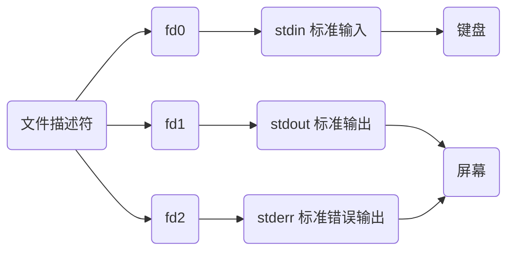
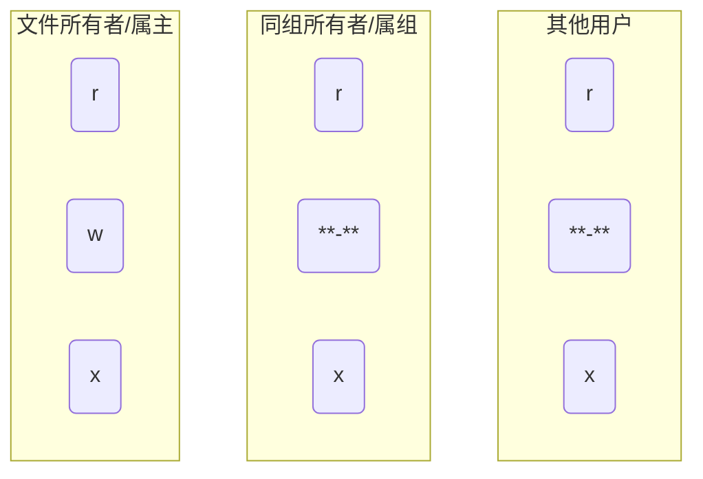

# 文件概念

## 类型

Linux中一切皆文件, 目录, 设备(包括字符设备, 块设备), 进程, 线程, 套接字, 管道都是文件

- 获取当前目录下所有文件属性

```sh
ls -l
```


文件属性首字符代表文件类型

| 类型         | 说明                                  | 首字符 | 颜色  |
| ------------ | -------------------------------------| ------ | ----- |
| 普通文件     | 包括纯文本、二进制、数据格式、压缩文件等 | `[-]`  | 白色  |
| 目录文件     | 类似Windows中的目录                    | `[d]`  | 蓝色  |
| 字符设备文件 | 串行端口的接口设备, 如键盘、鼠标等       | `[c]`  | 黄色  |
| 块设备文件   | 存储数据以供系统存取的接口设备, 既硬盘   | `[b]`  |       |
| 套接字文件   | 通常用在网络数据连接                    | `[s]`  |       |
| 管道文件     | `FIFO`(先进先出), 解决多程序同时存取文件 | `[p]` |        |
| 链接文件     | 类似Windows快捷方式                    | `[l]`  | 浅蓝色 |

- 表示bin是链接文件

```sh
lrwxrwxrwx    1 root root   7  12月 18 23: 21 bin -> usr/bin
```

## 文件描述符

文件描述符`fd`(file descriptor), 是指向某个文件的符号, 为非负整数, 可通过它访问打开的文件或设备

打开或创建文件时, 内核向进程返回一个文件描述符, 读写文件时, 使用open或creat返回的文件描述符标识该文件, 将其作为参数传给read或write

程序运行时, 一般会打开三个文件描述符, 如下表



Linux命令处理可描述为

```sh
fd[输入文件]->命令->fd[输出文件]
```

如 ls, 默认输入文件是键盘, 输出文件是屏幕

### 重定向

重定向可改变文件描述符`fd`所指向的文件

| 方向       | 符号        |
| --------- | ----------- |
| 输入重定向 | `<` 和 `<<` |
| 输出重定向 | `>` 和 `>>` |

```sh
echo "666" > a.txt

# fd作为标准输出可以省略, 上命令可写为
echo "666" 1> a.txt
```

echo本是`fd1`(标准输出), 默认指向屏幕, 经重定向后`fd1`指向a.txt, 字符输出到此文件


- 通过输出重定向丢弃信息

```sh
for i in {1..254};do
    ip="192.168.1.${i}"
    # 将标准/错误输出全部重定向到/dev/null中(丢弃产生的所有信息)
    ping -c 2 ${ip} > /dev/null &
done
```

## 权限


文件类型后的字符没三个为一组, 每组依次代表


每组内依次包含的读-写-执行的权限, 如下表

| 权限   | 含义                                          | 符号          | 代表数字 |
| ------ | -------------------------------------------- | ------------- | -------- |
| 可读   | 允许查看文件与目录列表                         | `r` (read)    | 4        |
| 可写   | 允许修改与在目录中新建、删除、移动文件或子目录   | `w` (write)   | 2        |
| 可执行 | 允许运行程序, 切换目录                         | `x` (execute) | 1        |
| 无权限 | 没有权限                                      | `-`           | 0        |

- boot目录文件属性信息

```sh
drwxr-xr-x   4 root root       4096 10月 13 18:09 boot
```



首字符 `d` 表示是目录文件

第一组 `rwx` 表示文件所有者拥有可读, 可写, 可执行权限

第二组 `r-x` 表示所有者同组用户拥有可读, 不可写, 可执行权限

第三组 `r-x` 表示其他用户拥有可读, 不可写, 可执行权限

## 修改

### 操作符格式


符号与操作符内容如下表

| 符号 | 用户类型  | 权限范围               |
| ---- | -------- | --------------------- |
| `u`  | user     | 文件所有者(属主)       |
| `g`  | group    | 文件所有者所在组(属组) |
| `o`  | other    | 所有其他用户           |
| `a`  | all      | 所用用户, 相当于 ugo   |

| 操作符 | 含义     |
| ------ | -------- |
| `+`    | 增加权限 |
| `-`    | 减去权限 |
| `=`    | 设置权限 |

- 给run.c 添加执行权限

```sh
chmod +x run.c
```

### 数字格式

```sh
chmod [rwx](数字) 文件/目录
```

给a.txt 文件添加全部权限

```sh
chmod 777 a.txt
```

### 修改所属用户与组

```sh
chown 属主 文件/目录

chown :属组 文件/目录

chown 属组:属组 文件/目录
```

新建 b.txt文件, 属主为 dmjcb, 属组为manager, 属主可读写执行, 属组可读写执行, 其他人只读

```sh
touch b.txt

useradd dmjcb

groupadd manager

chown dmjcb:manager b.txt

chmod 774 b.txt
```
