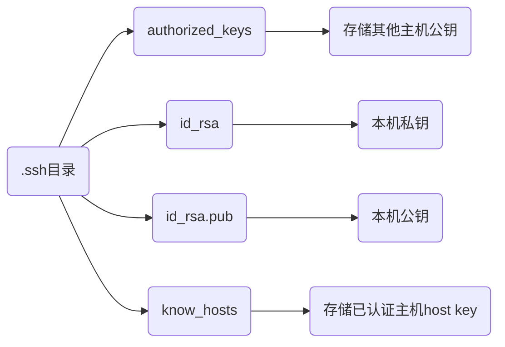

> [win10 ssh 上传密钥过程，出现 无法将"ssh-copy-id"项识别](https://blog.csdn.net/Defiler_Lee/article/details/116278442)

# SSH

## 命令

### 连接

```sh
ssh 用户名@IP地址 (-p 端口号)
```

连接192.168.3.3 dmjcb用户, 端口号默认20

```sh
ssh dmjcb@192.168.3.3
```


### 清除密钥

```sh
ssh-keygen -R [远程主机IP]
```

### 免密登录

可以手动将 本地`id_rsa.pub` 复制到远程主机`.ssh/authorized_keys`里

#### Linux设备

```sh
ssh-copy-id -i ~/.ssh/id_rsa.pub [远程用户]@[远程主机IP]
```


#### Windows设备

powershell中先执行

```powershell
function ssh-copy-id([string]$userAtMachine, $args){   
    $publicKey = "$ENV:USERPROFILE" + "/.ssh/id_rsa.pub"
    if (!(Test-Path "$publicKey")){
        Write-Error "ERROR: failed to open ID file '$publicKey': No such file"            
    }
    else {
        & cat "$publicKey" | ssh $args $userAtMachine "umask 077; test -d .ssh || mkdir .ssh ; cat >> .ssh/authorized_keys || exit 1"      
    }
}
```

```sh
ssh-copy-id [远程用户]@[远程主机IP]
```


### scp

```sh
scp -r 本地路径 远程用户@IP地址:远程目标路径
```

## 配置

### .ssh目录

在根目录(/root/或者/home/用户名)下生成 .ssh目录

```sh
ssh-keygen -t rsa
```




### 配置文件

```sh
/etc/ssh/sshd_condfig
```

```sh
# 允许密钥登录
RSAAuthentication yes

# 允许公钥验证 
PubkeyAuthentication yes

# 禁止密码登录
PasswordAuthentication no
```

## 工具

### 获取登录信息

/etc/ssh/目录下新建sshrc

```sh
#!/bin/bash

# 获取登录者的用户名
user=${USER}

# 获取登录者的IP地址
ip=${SSH_CLIENT%% *}

# 获取登录的时间
time=${date +%F%t%k:%M}

# 服务器的IP地址
server=${ifconfig wlp2s0 | sed -n '2p' | awk '{print $2}'}

echo ${user} ${ip} ${time} ${server}
```

### Web工具

> [WebSSH](https://github.com/huashengdun/webssh)

```sh
pip3 install webssh
```

- 直接运行wssh, 默认8888端口

```sh
wssh
```

- 绑定IP地址端口

```sh
wssh --address='IP地址' --port=端口
```