# 二叉排序树

## 概念

二叉排序树 $Binary$ $Sort$ $Tree(BST)$, 也称二叉查找树

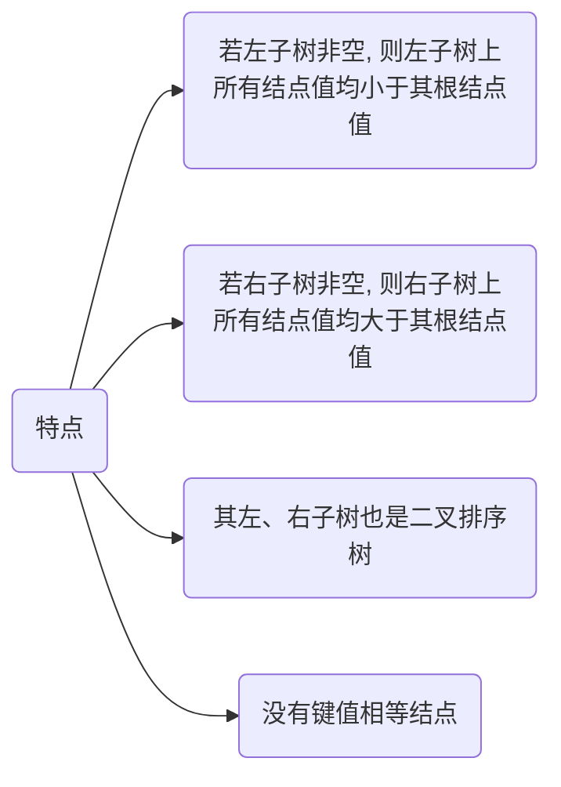

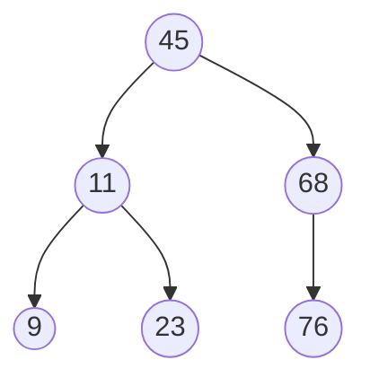

对该树进行中序遍历($LDR$)会得到一个递增的有序序列: $9, 11, 23, 45, 50, 68, 76$

## 查找

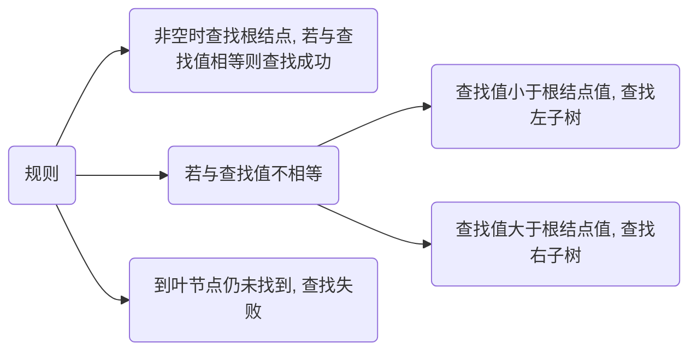

- 查找 $23$

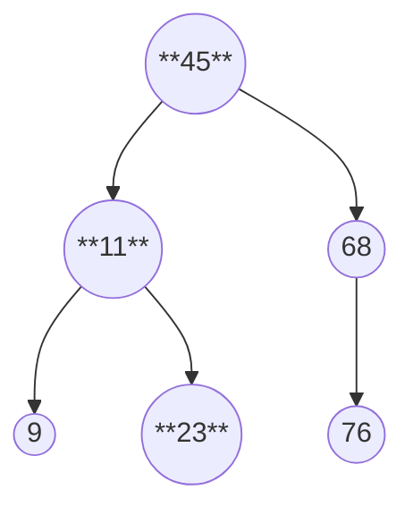

因为 $23 < 45$, 则查找左子树

因为 $23 > 11$, 则查找右子树, $23 = 23$, 查找成功

- 查找 $47$

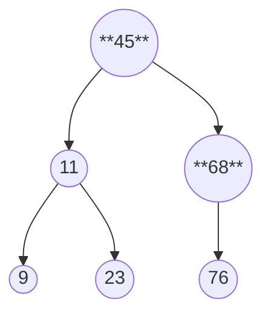

因为 $47 > 45$, 则查找右子树

因为 $47 < 68$, 则查找左子树, 左子树为空, 查找失败

### 递归写法

```c++
template<typename T>
struct BSTNode {
    T value;
    BSTNode<T> *leftSon;
    BSTNode<T> *rightSon;

    BSTNode(T value, BSTNode<T> *leftSon, BSTNode<T> *rightSon {
        this->value = value;
        this->leftSon = leftSon;
        this->rightSon = rightSon;
    }
};
```

```c++
template<typename T>
BSTNode<T> *Search(BSTNode<T> *root, const T value) {
    if (root == nullptr) {
        return nullptr;
    }

    if (root->value == value) {
        return root;
    }

    if (root->value > value) {
        return Search(root->lchind, value);
    }

    if (root->value < value) {
        return Search(root->rchind, value);
    }
}
```

### 非递归写法

```c++
template<typename T>
BSTNode<T> *Search(BSTNode<T> *root, const T value) {
    while(root != nullptr) {
        if (root->value == value) {
            return root;
        }

        if (root->value > value) {
            root = root->lchind;
        }

        if (root->value < value) {
            root = root->rchind;
        }
    }
    return nullptr;
}
```

## 插入

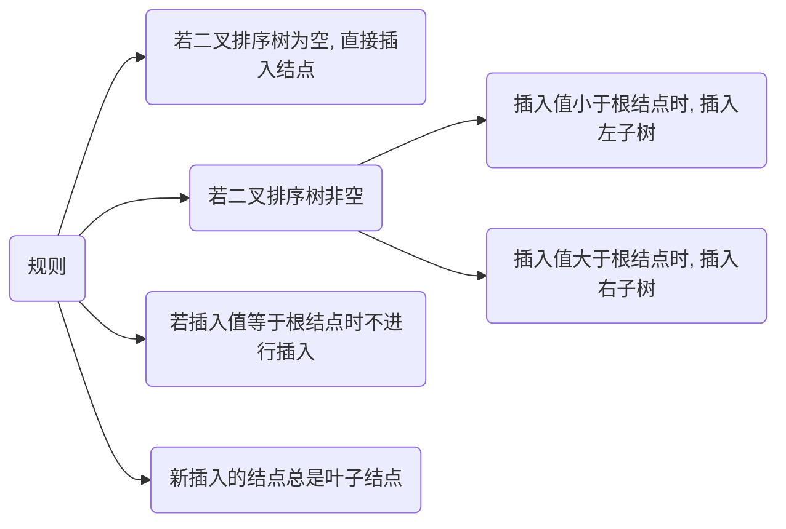

- 插入 $15$

因为 $15 < 45$, 选择左子树, 

因为 $15 > 11$, 选择右子树, 

因为 $15 < 23$, 选择左子树, 左子树为空, 插入

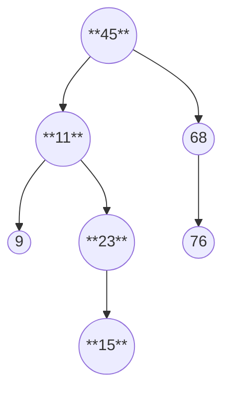

```c++
// 返回构建完成后的根节点
template<class T>
BSTNode<T> *AddNode(BSTNode<T> *root, const T value) {
    // 节点为空, 说明是叶子节点
    if(root == nullptr){
        root = new BSTNode<T>(value, nullptr, nullptr);
        return root;
    }

    // 值小于根结点时, 插入根节点的左子树
    if(root->value > value) {
        root->leftSon = AddNode(root->leftSo, value);
    }

    // 值大于根结点时, 插入根节点的右子树
    if(root->value < value) {
        root->rightSon = AddNode(root->rightSon, value);
    }
    return root;
}
```

### 构建

根节点为空, 进行插入操作

```c++
template<class T>
void Init(BSTNode<T> *root, vector<T> &v) {
    for(int i = 0, size = v.size(); i < size; i++) {
        root = AddNode(root, v[i]);
    }
}
```

## 删除

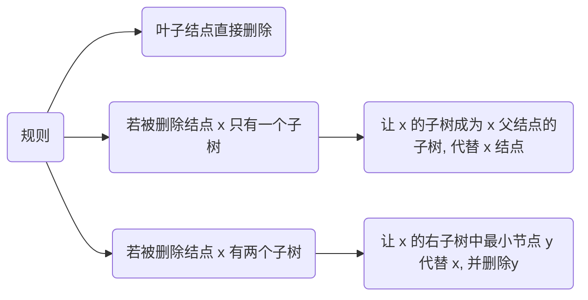

- 删除 $9$ 节点

$9$ 节点是叶子节点, 直接删除

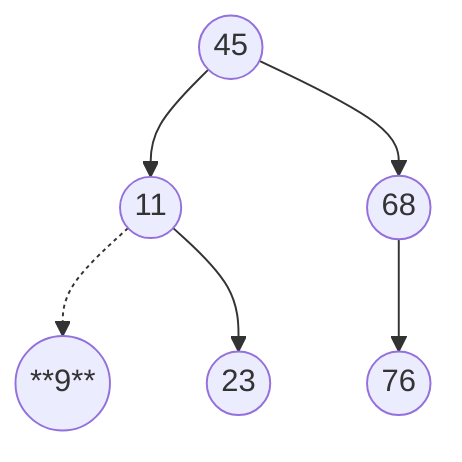

- 删除 $68$

$68$ 节点只有一个子树, 让 $68$ 的子树 $76$, 成为 $68$ 的父节点 $45$ 的子树

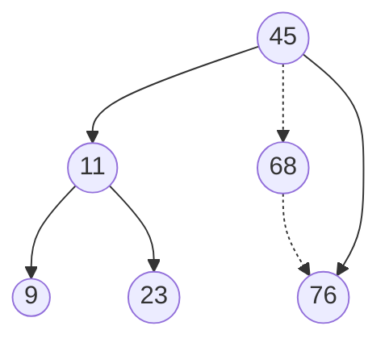

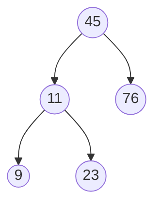

- 删除 $11$

$11$ 的右子树中最小节点为 $23$, 让 $23$ 代替 $11$

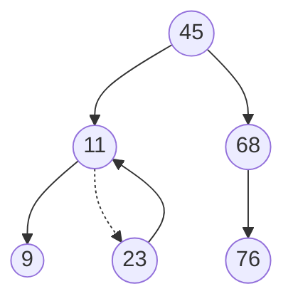

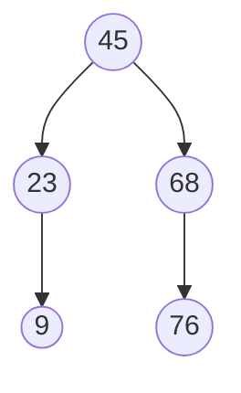

```c++
template<class T>
void DelNode(BSTNode<T> *root, const T value){
    if (root == nullptr) {
        return;
    }
    // p为待删除节点, fp为其父节点
    BSTNode<T> *p = root;
    BSTNode<T> *fp = root;

    while (p->value != value) {
        fp = p;
        if (p->value > value) {
            // 查找左子树
            p = p->leftSon;
        }

        if (p->value < value) {
            // 查找右子树
            p = p->rightSon;
        }
    }

    // 情况1, p为叶子节点, 直接删
    if (p->leftSon == nullptr && p->rightSon == nullptr) {
        if (fp->leftSon != nullptr) {
            fp->leftSon = nullptr;
        }

        if (fp->rightSon != nullptr) {
            fp->rightSon = nullptr;
        }

        delete(p);
        p = nullptr;

        return;
    }

    // 情况2, p左子树为空, 重接右子树
    if (p->leftSon == nullptr) {
        p->value = p->rightSon->value;
        p->rightSon = nullptr;

        delete(p);
        p = nullptr;

        return;
    }

    // 情况3, p右子树为空, 重接左子树
    if (p->rightSon == nullptr) {
        p->value = p->leftSon->value;

        delete(p->leftSon);
        p->leftSon = nullptr;

        return;
    }
    
    // 情况4, p左右子树均不为空时, 需要找p右子树中最小节点(最左节点)q
    BSTNode<T> *q = p->rightSon;
    // fq为q的父节点
    BSTNode<T> *fq = q;
    // 循环查找左节点, 就会找到最小值
    while(q->leftSon != nullptr) {
        fq = q;
        q = q->leftSon;
    }
    fq->leftSon = nullptr;
    // 用最小值节点代替欲删除节点
    p->value = q->value;

    delete(q);
    q = nullptr;
    return;
}
```

## 遍历

```c++
// 中序遍历
template<class T>
void OutputBST(BSTNode<T> *root) {
    if (root->leftSon != nullptr) {
        OutputBST(root->leftSon);
    }

    std::cout << root->value << std::endl;

    if (root->rightSon != nullptr) {
        OutputBST(root->rightSon);
    }
}
```
